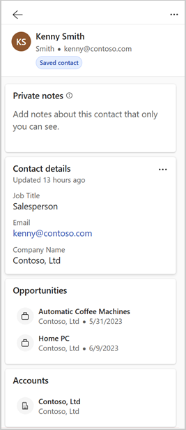
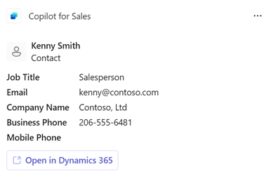
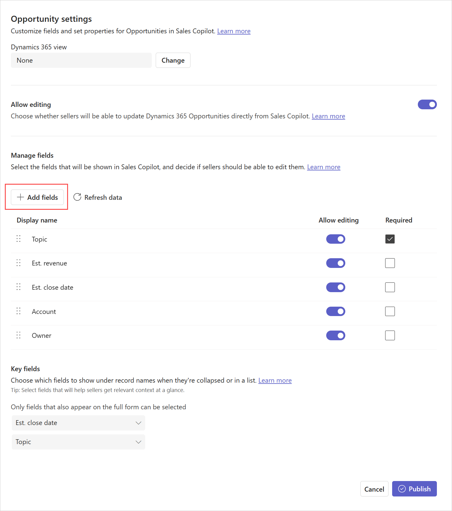

# Customize forms and fields

As an administrator, you can customize the CRM information that's displayed in Copilot for Sales to give your sellers a more relevant view.

CRM forms and fields customization is environment-specific—each environment has its own set of configurations. Contact, opportunity, and account record types are available by default. You can add other out-of-the-box and custom record types; and also remove them when not required.

Copilot for Sales forms and lists are based on CRM views. A view defines the list of columns to be displayed, how the list of records is sorted by default, and what default filters are applied to restrict which records will appear in the list. For account and opportunity record types, it is not mandatory to select a view. If you don't select a view, the default view is used. For other record types, you must select a view.

> [!NOTE]
> You cannot select a view for the Contact record type.

Changes made to record types are reflected in the Copilot for Sales pane in Outlook, Copilot for Sales panel in Microsoft Teams, and Adaptive Cards shared in Teams chat. When saving Outlook activities (emails and meetings) from Copilot for Sales to your CRM system, you can search for records of the added record types, and connect the activity to the record. When using Copilot for Sales app for Teams through messaging extensions, you can search for records of the added record types.

Record names, field names, and mandatory fields are displayed as they're defined in the CRM.

> [!IMPORTANT]
> The term record type used in this article refers to a Salesforce object in Copilot for Sales. The term displayed on user interface depends on the CRM system you're connected to. If you're connected to Dynamics 365, **record type** is displayed. If you're connected to Salesforce, **object** is displayed.

:::image type="content" source="media/admin-settings.png" alt-text="Screenshot showing Copilot for Sales admin settings.":::

|Annotation  |Description  |
|---------|---------|
|1     |Select to customize forms and fields.  |
|2     |Add a new custom or out-of-the-box record type. More information: [Add a new record type](#add-a-new-record-type-or-a-salesforce-object)  |
|3     |Refresh data from CRM. More information: [Refresh data from CRM](#refresh-data-from-crm) |
|4     |Record types added to Copilot for Sales.  |
|5     |CRM view used to control the form of a record type. More information: [Change view of a record type](#change-view-of-a-record-type) |

You can select a record type to view and edit its settings.

## Prerequisites

CRM administrators must access administrator settings from the Copilot for Sales app in Teams. More information: [Administrator settings for Copilot for Sales](administrator-settings-for-viva-sales.md)

## Add a new record type (or a Salesforce object)

You can add new custom or out-of-the-box record types to Copilot for Sales. For example, you can add a custom record type called "Project" to track projects. You can add a maximum of 10 record types.

> [!IMPORTANT]
> The term record type refers to a Salesforce object in Copilot for Sales.

1. In Copilot for Sales admin settings, select **Forms**.

2. Select **Add a record type** or **Add an object**.

3. In the **Add a record type** or **Add an object** window, select a record type to add, and then select **Next**.

    > [!NOTE]
    > - Only record types that are related to a currently available record type are displayed. For example, contact, account, and opportunity record types are available by default, so you can add other out-of-the-box and custom record types that are related to these record types.
    > - You can add only one record type at a time.
    > - Logical names of record types and fields are displayed to optimize performance.
    > - For Dynamics 365, ActivityParty and ActivityPointer record types can't be added, as they are currently not supported. 
    > - For Salesforce, the Note object can't be added, as it's currently not supported.

    :::image type="content" source="media/select-record-type.png" alt-text="Select a record type to add.":::

4. In the **Select the relationship for (record type)** window, select the relationship to existing record types or fields in Copilot for Sales, and then select **Next**.

    > [!NOTE]
    > - 1:N and N:1 relationships are supported.
    > - Logical names of record types and fields are displayed to optimize performance.
    > - This step is displayed if the record type you selected in the previous step relates to more than one record type or field. Otherwise, the relationship is automatically set.
    > - If the required relationship is not displayed, reorder the record types in admin settings. More information: [Impact of the order of record types on relationships](#impact-of-the-order-of-record-types-on-relationships)

    :::image type="content" source="media/select-relationship.png" alt-text="Select relationship for the record type.":::

5. In the **Select the view for (record type)** window, select the view to define how a list of records for a specific record type is displayed, and then select **Add**.

    > [!NOTE]
    > - All public and personal views are displayed in the list.
    > - For Dynamics 365, Copilot for Sales includes only those fields that belong to the record type and not to any related record types.

    :::image type="content" source="media/select-view.png" alt-text="Select view for the record type.":::

6. On the record type settings page, select **Publish** to save your changes.

    The record type is added at the end of the list of record types.

## Modify existing record types

After you add a record type, you can modify it by performing actions such as changing its view, adding/removing fields, and reordering fields. The actions depends whether the record type is based on a CRM view or not.

Modifying a record type enables you to customize the detailed view of CRM records in Copilot for Sales. Changes to the detailed view are reflected in the Copilot for Sales pane in Outlook, Copilot for Sales panel in Microsoft Teams, and Adaptive Cards shared in Teams chat.

> [!NOTE]
> If you change the name of a record type in CRM, they are not updated in Adaptive Card or messaging extensions in Teams. For example, if you rename Account to Customer, the name in Adaptive Card and messaging extensions will show as Account.

### Modify record types based on a CRM view

If a record type is based on a CRM view, you should change the CRM view to change the fields and the order in which they should appear. You must then select **Refresh data** to get latest changes from CRM and apply them in Copilot for Sales.

#### Change view of a record type

You can change the view that a record type is based on by choosing a different view. For example, you can select a view to show only active accounts instead of all accounts.

When changing the view, the following existing settings for the record type are cleared and set to default.

- Existing key fields are removed, and new defaults are set.
- Edit behavior for record type remains unchanged.
- Edit behavior for fields is reset. If the record type is set to editable, and a new view is selected, the fields will become editable.

**To select a new view**

1. In Copilot for Sales admin settings, select **Forms**.

2. Select a record type for which you want to change the view.

3. Select **Change** beside the view field.

    :::image type="content" source="media/change-view.png" alt-text="Change view of a record type.":::    

4. Update the relationship, if required, and then select **Next**.

5. Select the view to use, and then select **Done**.

6. On the record type settings page, select **Publish** to save your changes.

#### View filters used in a view

You can view the source query that's used to filter records in a view. For example, you can view the source query for the view that shows only active accounts.

It helps you to have clear understanding on how a record type is configured. For example, filtering and sorting criteria of fields, and order of fields. The query is displayed in a view-only mode and you can't make any changes to the query.

1. In Copilot for Sales admin settings, select **Forms**.

2. Select a record type for which you want to see the query used in the selected view.

3. Select **View filters** under the **Manage fields** section.

    :::image type="content" source="media/view-filters.png" alt-text="View filters used in a view.":::
    
    The **Filter conditions** window is displayed.

4. To copy the query XML, select **Copy XML**.

### Modify record types not based on a CRM view

> [!NOTE]
> This section is relevant only for contact, opportunity, and account record types that are not based on a CRM view. If a view is selected for a record type, you'll not be able to [add fields](#add-fields), [remove fields](#remove-fields), and [reorder fields](#reorder-fields).

If a record type is not based on a CRM view, you can select fields to include in the view and the order in which they should appear. Up to 40 out-of-the-box and custom fields can be added to a record form.

#### Add fields

**To add fields**

1.  In Copilot for Sales admin settings, select **Forms**.

2.  Select a record type to which you need to add fields.

3.  In the **Manage fields** section, select **Add fields**.

    

4.  In the **Add fields** window, select fields to display in the form, and then select **Add**.

    The new fields are added after existing fields, but you can [reorder them](#reorder-fields).

    > [!NOTE]
    > If you've connected Copilot for Sales to Salesforce, add only the fields that all users of Copilot for Sales have access to. If a user doesn't have access to some of the added fields, they'll not be able to view the CRM record.

5.  Select **Publish** to save your changes.

#### Remove fields

1.  In Copilot for Sales admin settings, select **Forms**.

2.  Select the record type from which you need to remove fields.

3.  In the **Manage fields** section, hover over the field you want to remove from the form, and then select **Remove field** ().

4.  Select **Publish** to save your changes.

#### Reorder fields

1.  In Copilot for Sales admin settings, select **Forms**.

2.  Select the record type in which you need to reorder fields.

3.  In the **Manage fields** section, hover over the field you want to reorder, and then select the **Move up** or **Move down** arrows ( ).

    You can also drag the field to change its order.

4.  Select **Publish** to save your changes.

## Mark fields as required in Copilot for Sales

If the fields in CRM are not marked as required, you can mark them as required only for Copilot for Sales. Sellers will be required to enter values for these fields before they can save the record in Copilot for Sales.

> [!NOTE]
> - If a field is marked as required in CRM, it's marked as required in Copilot for Sales as well and you can't make it optional.
> - If you're using Salesforce, and [you've marked a field as required using the page layout option](https://help.salesforce.com/s/articleView?id=000384974&type=1), the field is not marked as required automatically in Copilot for Sales. You must manually mark the field as required in Copilot for Sales.  

1.	In Copilot for Sales admin settings, select **Forms**.

2.	Select a record type for which you need to mark the fields as required.

3.	In the **Manage fields** section, select **Required** for the fields that you want to mark as required.

    :::image type="content" source="media/admin-required-fields.png" alt-text="Screenshot showing how to mark fields as required.":::

4.	Select **Publish** to save the changes.

## Configure editing of records and fields

Sellers can edit records by opening them in CRM from a link in Copilot for Sales. Help them be more productive by allowing them to edit records directly in Copilot for Sales. You can also control which fields sellers can edit directly in Copilot for Sales.

By default, contacts are editable. For other records, you must turn on the option to allow editing.

**To allow editing of records**

1.  In Copilot for Sales admin settings, select **Forms**.

2.  Select the record type that you must allow editing for.

3.  In the **Editing records** section, select **Edit records inside Copilot for Sales** to allow sellers to edit all relevant fields for that record type.

4.  To restrict editing for specific fields, in the **Manage fields** section, turn off **Allow editing** for the appropriate fields.

    :::image type="content" source="media/viva-sales-allow-edit.png" alt-text="Screenshot showing how to enable editing of records and fields in Copilot for Sales.":::

5.  Select **Publish** to save your changes.

## Configure new record creation

Choose whether, how, and where sellers can create new records from Copilot for Sales. Help them save time by allowing them to create new records inline, directly in Copilot for Sales, and make it easy for them to go to their CRM in a browser with a click.

**To configure new contact creation**

1.  In Copilot for Sales admin settings, select **Forms**.

2.  Select the record type that you must configure new record creation for.

3.  In the **Creating records** section, select one or both of the following options:

    - **Create new records inside Copilot for Sales**: Allow sellers to create new records inline, directly in Copilot for Sales.
    - **Create new records by opening (CRM) from a link**: Allow sellers to create new records in CRM by opening a link in a browser.

    :::image type="content" source="media/viva-sales-inline-contact-create.png" alt-text="Screenshot showing how to configure contact creation in Copilot for Sales.":::

4.  Select **Publish** to save your changes.

## Configure leads support (preview)

[!INCLUDE [preview-banner-section](includes/preview-banner-section.md)]

When you enable leads support in Copilot for Sales, leads related accounts and other related records are displayed to the sellers. Sellers can:
- View existing leads in Copilot for Sales.
- Create and edit lead records inline in Copilot for Sales.
- Associate emails and meetings with lead records.
- Disambiguate between multiple leads matches.

After you enable leads support, the user experience to work with leads is similar to working with contacts. You'll notice a minor difference in the flow to create a new contact or lead. You'll be able to choose whether you want to add an external email address as a contact or a lead.

### Prerequisites
 
- Recognize leads in Copilot for Sales
    - You must add the Leads record (or Salesforce object) to Copilot for Sales admin settings.
    - The Leads record form must have the First Name, Last Name, and Email address1 fields added and set to required.
    - The Leads view that is selected must include the above mentioned fields as columns.
 
- Related entity card support in Salesforce (as with contacts)
    - A custom relationship between Leads and Account must be established in the CRM system.
    - The view for the Account object in Copilot for Sales settings must be changed to any view other than the default **None**.
    - The Account field must be added as a column in the view that is selected for the Lead record or object.

- Saving to lead in Salesforce
    - A limitation in Salesforce query doesn't allow leads to be displayed in the **Connected to** search experience. To associate an email with leads and contacts on a thread, sellers must save the email without connecting to a record. The email or meeting will still be associated with leads and contacts on the To, Cc, and Bcc fields.

## Select key fields for the mini view

Each record type has a mini view that displays limited information when they're collapsed or shown in a list. The mini view is available at various places in the Copilot for Sales pane, such as in the quick view on the CRM tab.

The mini view includes a fixed title and two configurable subtitle fields. The fields available in the mini view are the ones that are available in the detailed view. Key fields setting affect the Search behavior in Copilot for Sales add-in for Outlook. More information: [Search behavior in Copilot for Sales add-in for Outlook](#search-behavior-in-copilot-for-sales-add-in-for-outlook)

**To select key fields**

1.  In Copilot for Sales admin settings, select **Forms**.

2.  Select the record type in which you need to select fields for mini view.

3.  In the **Key fields** section, select fields from the list.

    

4.  Select **Publish** to save your changes.

### Search behavior in Copilot for Sales add-in for Outlook

Key field settings affect the results when sellers search for connected records in Dynamics 365. In Dynamics 365, the search behavior for connected records depends on the quick find view. Make sure that the key fields you select for the mini view exist in the [quick find view](/dynamics365/customerengagement/on-premises/customize/choose-and-configure-columns?view=op-9-1&preserve-view=true), otherwise, the search list won’t show them. In Salesforce, the search is performed on the name and the additional fields selected for the mini view.

Key fields selected for record types affect the search results displayed for these records. Key fields are displayed, if they are not empty, along with the name of the record in the search results.

## Refresh data from CRM

You should refresh data to get recent changes from CRM into Copilot for Sales. For example, if you add a new field to a record type view in CRM, you should refresh data to reflect the new field in Copilot for Sales. You can refresh data either for all record type at once or for a specific record type.

### Refresh data for all record types

1. In Copilot for Sales admin settings, select **Forms**.

2. Select **Refresh data**.

### Refresh data for a specific record type

1. In Copilot for Sales admin settings, select **Forms**.

2. Hover over a record type for which you want to refresh data, and then select **More options** (**...**).

3. Select **Refresh** from the context menu.

Alternatively, you can select the record type, and then select **Refresh data** under **Manage fields**.

## Remove a record type

1. In Copilot for Sales admin settings, select **Forms**.

2. Hover over the record type you want to remove, and then select **Remove (record type)** (:::image type="icon" source="media/delete-icon.png" border="false":::).

> [!NOTE]
> - When you remove a record type that has related record types in Copilot for Sales, all related record types are also removed.
> - You can't remove the contact record type.

## Control the order of record types in Outlook side pane

The order in which record types are added to admin settings determines the order in which they're displayed in the **Copilot for Sales** side pane in Outlook. By default, the order of record types in a new environment is contact, opportunity, and account. Newly added record types are added at the end of the list.

You can change the order by removing and adding record types in the required order.

## Impact of the order of record types on relationships

The order of record types in admin settings affects the relationship settings between record types. When you add a new record type, you can select the relationship to existing record types or fields in Copilot for Sales. Only relationships with record types that precede the current record type in the list are displayed in the **Select the relationship for (record type)** window. 

For example, let's assume that the order of record types is contact, opportunity, and account. In this case, the relationship between opportunity and account is displayed in the account settings, and not in the opportunity settings because account is configured after opportunity. Opportunity is considered the source record type, and account is the related record type. In this scenario, Copilot for Sales is configured to fetch accounts related to opportunities, but not opportunities related to accounts. The exception to this is when the CRM view is set to **None**. When no view is selected, default relationships are used instead of any previously selected relationships. In this case, the ordering of record types doesn't matter.

Therefore, adjust the ordering of record types in admin settings by removing and re-adding record types in the required order. Ensure that the source record type is configured before the related record type. Then, select the required relationship in the related record type settings.

## Impact of CRM customization on collaboration spaces

[Collaboration spaces](collaboration-space.md) can be created in Microsoft Teams based on the Account and Opportunity record types (or Salesforce objects) available in Copilot for Sales admin settings.

The following table lists the change in admin settings and the corresponding behavior of collaboration spaces:

|Record types (or Salesforce objects) available  |Behavior of collaboration spaces  |
|---------|---------|
|Account and opportunity are available     |  Collaboration spaces can be created for accounts and opportunities.       |
|Account is available and opportunity is not available     |  Collaboration spaces can be created only for accounts.       |
|Account is not available, and opportunity is available     |   Collaboration spaces can be created only for opportunities.      |
|Account and opportunity are not available     |  Collaboration spaces cannot be created. The **Collaborate in Teams** card is not visible on the **Copilot for Sales** pane in Outlook.       |

