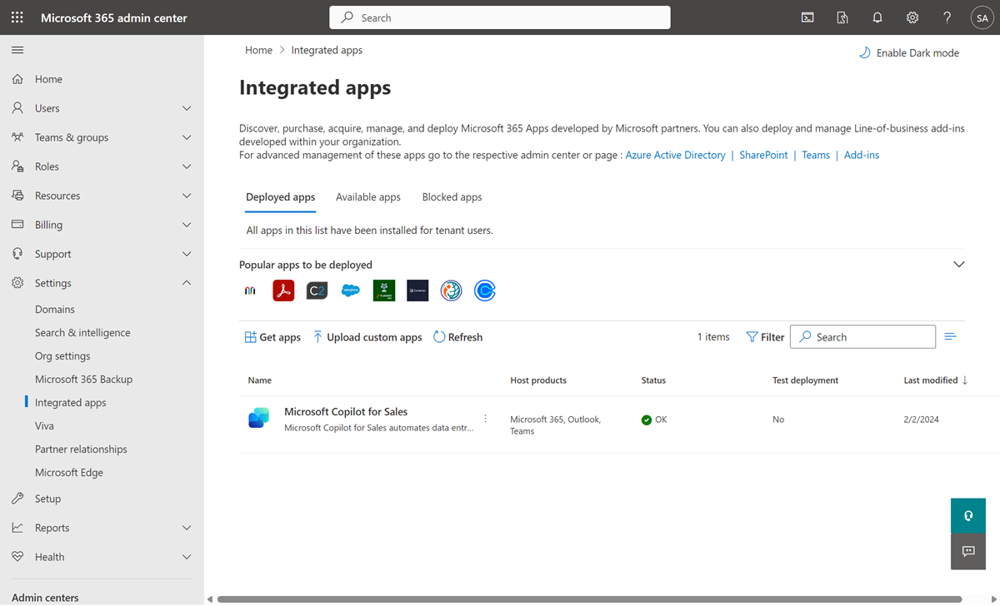
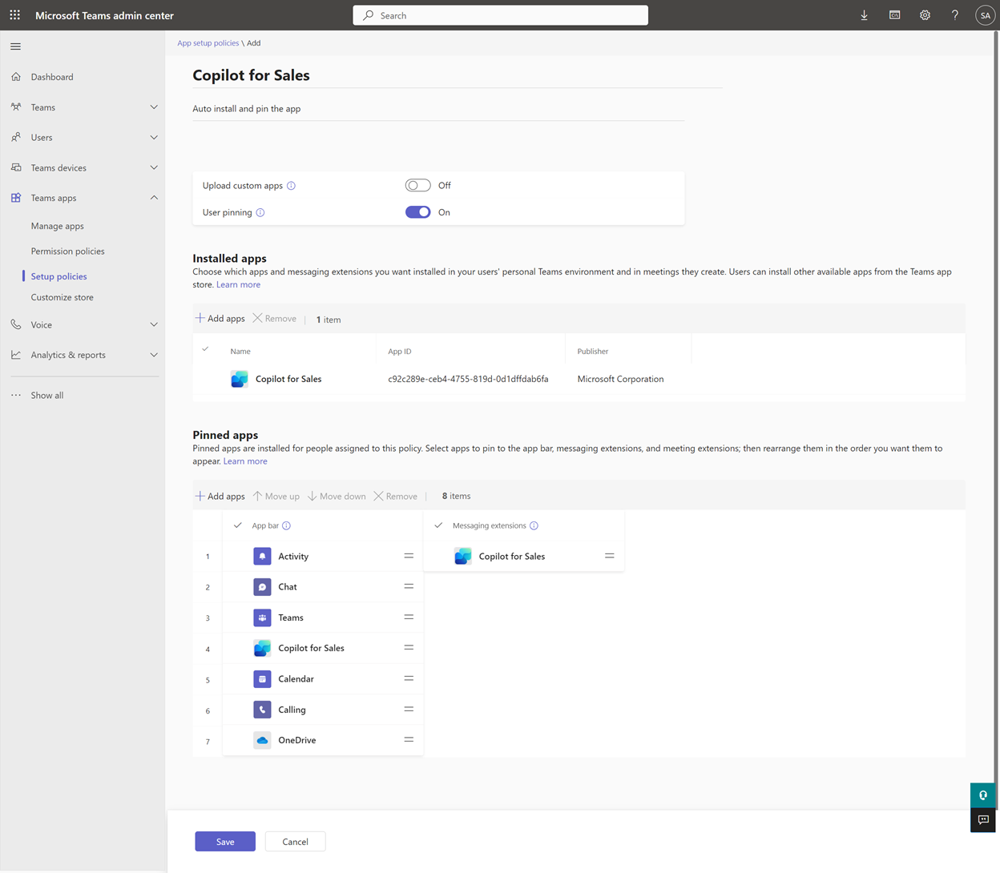
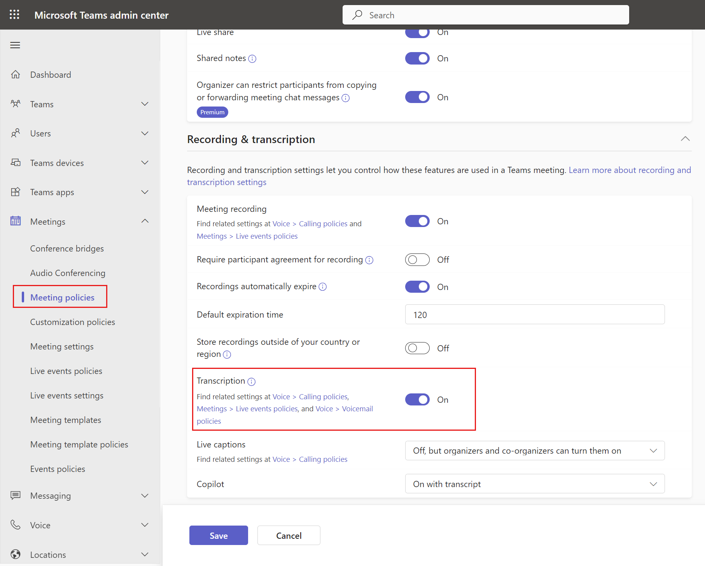

# Sales app deployment guide for Salesforce CRM customers

Follow the instructions in this guide to deploy the Sales app for your Salesforce CRM customers.

## Prerequisites

- You must be a tenant administrator to install the integrated app from the [Microsoft 365 admin center](https://admin.microsoft.com/). [How do I find my tenant admin?](sales-m365-copilot-faq.md#how-do-i-find-my-tenant-admin)
- You must be a Teams administrator to create a setup policy in the [Teams admin center](https://admin.teams.microsoft.com/dashboard).
- You must assign the Microsoft 365 Copilot license to each user that will be using the product. [Learn more about assigning licenses from the Microsoft 365 admin center](/microsoft-365/admin/manage/assign-licenses-to-users?view=o365-worldwide&preserve-view=true)

## Step 1: Install the Sales app in Outlook

[Install the Sales app in Outlook](install-sales-as-an-integrated-app.md)

> [!NOTE]
> It can take up to 24 hours for the add-in to show up for your users.

## Step 2: Create a setup policy to auto install and pin the Sales app in Teams

[Install and pin the Sales app in your sellers' personal Teams environment and meetings they create](install-pin-sales-teams.md)

## Step 3: Enable Teams meeting transcripts

Enable transcripts for Teams calls so that when the Sales app is added to a recorded Teams meeting, it can generate a meeting summary.

1.  Sign in to the [Teams admin center](https://admin.teams.microsoft.com).

2.  In the left pane, select **Meetings** &gt; **Meeting policies**.

3.  On the **Manage policies** tab, select **Global (Org-wide default)**.

5.  On the **Global (Org-wide default)** page, scroll down to the **Recording & transcription** section, and turn on the **Transcription** toggle.

6.  Select **Save**.

    

## Step 4: Confirm users have the right security roles

The Sales app applies your organization's existing CRM access controls and user permissions. Administrators must have correct permissions to customize their CRM systems, and users must have the correct permissions to view, update, and create records in their CRM systems from the Sales app.

Salesforce administrators who need to customize the Sales app [must have appropriate permissions](privileges.md#permissions-required-for-salesforce-administrators).

Users of the Sales app need to be API enabled in Salesforce so that they can access Salesforce using APIs. [Learn how to grant API Enabled permission](tsg-api-perm.md).

## Step 5: Ensure Salesforce connector isn't blocked in Power Platform

If there are Data Loss Prevention (DLP) policies defined in Power Platform for the msdyn_viva environment, ensure that the Salesforce connector is on the allow list. [Learn more about allowing Salesforce connector in the DLP policy](tsg-blocked-connector-sf.md)

## Step 6: Ensure Microsoft Power Platform connected app isn't blocked in Salesforce

The Sales app uses the Power Platform connector to connect to Salesforce CRM. Ensure that the connector is enabled for the Sales app users.

1. Sign in to Salesforce CRM as an administrator.

2. Go to **Setup** > **Platform Tools** > **Apps** > **Connected Apps** > **Managed Connected Apps**.

3. Ensure that **Microsoft Power Platform** is listed under **Connected Apps**.

    > [!NOTE]
    > If **Microsoft Power Platform** is not listed under **Connected Apps**, go to the **Connected Apps OAuth Usage** page, and then select **Install** for Microsoft Power Platform.

4. Select **Microsoft Power Platform** to view details about the connected app. 

5. Under **OAuth Policies**, ensure that you've set the following values:

    1. Value for **Permitted Users** is set to **Admin approved users are pre-authorized** or **All users may self-authorize**.

        > [!NOTE]
        > If **Admin approved users are pre-authorized** is selected, you must explicitly grant permissions to individual users through policies and permissions sets.

    2. Value for **IP Relaxation** is set to **Relax IP restrictions**.
    3. Value for **Refresh Token Policy** is set to **Refresh token is valid until revoked**.

6. Under **Session Policies**, ensure that the value for **Timeout Value** is set to **None**.

7. Under **Profiles** or **Permission Sets**, check whether there are any existing profiles or permission sets or if they're empty. Check and add the appropriate target for your users.

## Step 7: First user sign in

When the first user signs in to Salesforce CRM from the Sales app in [Outlook](sign-in-crm-outlook.md#manually-sign-in) or [Teams](sign-in-crm-teams.md#manually-connect-to-crm), an API call is triggered to provision a msdyn_viva Dataverse environment for the tenant to store the data generated while using the Sales app. 

The environment is provisioned using server-to-server (S2S) authentication, which means any user can initiate the process. The platform API provisions the trial environment and assigns the administrator role to a predefined admin user rather than the initiating user. For more details on the architecture and how data is stored, go to [Sales app architecture](architecture.md).

> [!WARNING]
> Do not remove or edit the **msdyn_viva** environment because it is holds important data for the Sales app. If the environment is removed or edited, the Sales app might stop working.

**Administer roles in the provisioned environment**

The Sales app automatically assigns all Power Platform administrators and Microsoft 365 global administrators to the System Administrator role in the trial environment. After the environment is created, it is recommended to review the list of administrators to ensure appropriate access levels.

> [!IMPORTANT]
> In the Power Platform Admin Center, tenant administrators can restrict trial environment creation to administrators. However, due to the current provisioning flow, this setting is bypassed because the system assigns a predefined administrator during provisioning. This means tenant administrators cannot gate these environments from being created.

## Step 8 (optional): Customize the Sales app

[Administrator settings](administrator-settings-sales-app.md) control the seller's the Sales app experience in Outlook and Teams. You can customize the Sales app to meet your organization's needs.

### Set up Copilot AI features

You can [set up AI features in the Sales app](suggested-replies.md) to use AI features that are in preview or generally available.

### Customize forms and fields

The Sales app comes configured to allow users to be productive out-of-the-box. You can [customize forms and fields](customize-forms-and-fields.md) as needed.

## Step 9: Welcome sellers to the Sales app

Now that you've installed and configured the Sales app in Outlook and Teams, get your sellers to use it. Here's an example email message you can share.

| |
|---------|
|**Subject**: Welcome to the Sales app!  Dear Sellers,  Welcome to the Sales app, a new app that brings CRM data and AI-powered intelligence into your flow of work in Outlook and Teams.  See what the Sales app can do for you by taking the [Sales app training](/training/modules/boost-sales-performance/).   **Step 1: Logging into the Sales app for the first time**  [Sign in to your CRM system](sign-in-crm-outlook.md) and [pin the app](open-app.md#pin-the-sales-app-in-outlook).  **Additional resources**  The following articles guide you through using various the Sales app features: <ul> <li>[Connect a contact to your CRM](connect-contact.md)</li> <li>[Change the connected CRM contact](change-connected-crm-contact.md)</li> <li>[Create a contact in your CRM from the Sales app](create-contact-crm.md)</li> <li>[Save Outlook activities to your CRM](save-outlook-activities-crm.md)</li> <li>[View recent and upcoming activities](view-recent-upcoming-activities.md)</li> <li>[View record details](view-record-details.md)</li> <li>[Add private notes](add-personal-notes.md)</li> <li>[Share a link to a CRM record](share-link-crm-record.md)</li> <li>[Edit a CRM record](edit-crm-record.md)</li> <li>[Draft email messages](use-copilot-kickstart-email-messages.md)</li> <li>[Generate a meeting summary](create-teams-meeting.md#generate-a-meeting-summary)</li> <li>[View sales insights in Microsoft Teams meeting recap](view-meeting-summary-recap.md)</li> <li>[Share a link to a CRM record](share-link-crm-record.md)</li> <li>[View and update CRM record details](view-update-crm-record-details.md)</li> </ul>**Troubleshooting**  See the [Sales app troubleshooting guide](troubleshoot.yml) article for common problems and solutions.  For additional community help, visit the [Sales app - Microsoft Community Hub](https://techcommunity.microsoft.com/t5/viva-sales/bd-p/VivaSales) page.  For ideas and suggestions, visit the [Sales app Community](https://feedbackportal.microsoft.com/feedback/forum/7fcacc26-460c-ed11-b83d-000d3a4d91d1) page.     |

> [!IMPORTANT]
> It can take up to 48 hours for the app to appear in Outlook and other Microsoft 365 apps. If users can't see the app after 48 hours, it might be due to the public attachment handling policy. More information: [Why can't users see the Sales app in Outlook after it's deployed?](sales-m365-copilot-faq.md#why-cant-users-see-the-sales-app-in-outlook-after-its-deployed)

## Community

We encourage all users of the Sales app to visit and register on the [Sales app community](https://techcommunity.microsoft.com/t5/viva-sales/bd-p/VivaSales). The community has:

-   Forums to connect with peers and discuss shared experiences.

-   Forums to contribute and receive support on common issues, which are routinely reviewed by our team of experts.

-   Spaces to [share ideas](https://feedbackportal.microsoft.com/feedback/forum/7fcacc26-460c-ed11-b83d-000d3a4d91d1) and engage with the product development team.

