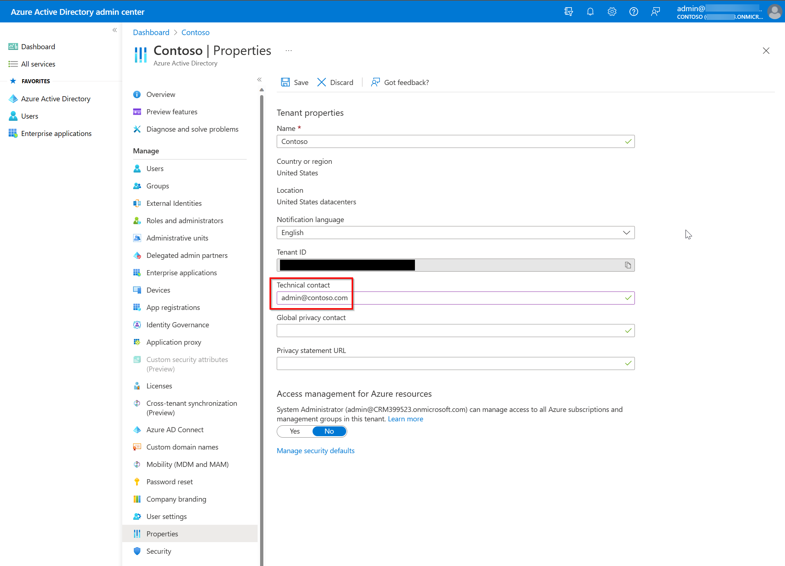

# Sales Copilot deployment guide for Dynamics 365 customers

Follow the instructions in this guide to deploy Sales Copilot for your Dynamics 365 Sales customers. Here's a quick video overview of the steps involved:

 

> [!VIDEO https://www.microsoft.com/en-us/videoplayer/embed/RW1dJYp]

## Prerequisites

- You must be a tenant administrator to install the integrated app from the [Microsoft 365 admin center](https://admin.microsoft.com/). [How do I find my tenant admin?](#how-do-i-find-my-tenant-admin)
- You must be a Teams administrator to create a setup policy in the [Teams admin center](https://admin.teams.microsoft.com/dashboard).

## Step 1: Install and deploy the Sales Copilot Outlook Add-in

[Install Sales Copilot Add-in for Outlook](install-viva-sales-as-an-integrated-app.md)

## Step 2: Create a policy to automatically install and pin the Sales Copilot app in Teams

[Install and pin Sales Copilot in your sellers' personal Teams environment and meetings they create](install-pin-viva-sales-teams.md)

## Step 3: Enable Teams meeting transcripts

Enable transcripts for Teams calls so that when Sales Copilot is added to a recorded Teams meeting, it can generate a meeting summary.

1.  Sign in to the [Teams admin center](https://admin.teams.microsoft.com).

2.  In the left pane, select **Meetings** &gt; **Meeting policies**.

3.  On the **Manage policies** tab, select **Global (Org-wide default)**.

5.  On the **Global (Org-wide default)** page, scroll down to the **Recording & transcription** section, and turn on the **Transcription** toggle.

6.  Select **Save**.

    

## Step 4: Set up server-side synchronization of emails and appointments

Sales Copilot allows sellers to save Outlook emails and appointments to Dynamics 365. Saving Outlook activities to Dynamics 365 requires [server-side synchronization for emails and appointments](/power-platform/admin/set-up-server-side-synchronization-of-email-appointments-contacts-and-tasks) to be enabled. While sellers can enable server-side synchronization for their own mailboxes when they save Outlook activities to Dynamics 365 using Sales Copilot for the first time, you can simplify their experience by setting up server-side synchronization of emails and appointments for all Sales Copilot users. 

For information about enabling server-side synchronization, see [Connect to Exchange Online](/power-platform/admin/connect-exchange-online). 

## Step 5: Confirm users have the right security roles

If you're using the following out-of-the-box Dynamics 365 Sales security roles, you don't need to do anything. Sales Copilot privileges are added automatically for:

-   Primary sales roles: Salesperson or Sales Manager

-   Administration roles: System Administrator or System Customizer

If you're using custom security roles, [assign users the right roles and privileges required for Dynamics 365 customers](install-viva-sales.md#additional-privileges-required-for-dynamics-365-customers).

## Step 6 (optional): Customize Sales Copilot

[Administrator settings](administrator-settings-for-viva-sales.md) control the seller's Sales Copilot experience in Outlook and Teams. You can customize Sales Copilot to meet your organization's needs.

### Set up Copilot AI features

You can [set up AI features in Sales Copilot](suggested-replies.md) to use AI features that are in preview or generally available.

### Customize forms and fields

Sales Copilot comes configured to allow users to be productive out-of-the-box. You can [customize forms and fields](customize-forms-and-fields.md) as needed.

### Integrate with other applications

You can [integrate Sales Copilot with other applications](use-extensions.md) to extend the capabilities of Sales Copilot.

## Step 7: Welcome sellers to Sales Copilot

Now that you've installed and configured Sales Copilot in Outlook and Teams, get your sellers to use it. Here's an example email message you can share.

| |
|---------|
|**Subject**: Welcome to Sales Copilot!  Dear Sellers,  Welcome to Sales Copilot, a new app that brings CRM data and AI-powered intelligence into your flow of work in Outlook and Teams.  See what Sales Copilot can do for you by [watching this short video](https://www.microsoft.com/en-us/videoplayer/embed/RW181Q6) and taking the [Microsoft Sales Copilot training](/training/modules/boost-sales-performance/).   **Step 1: Logging into Sales Copilot for the first time**  The [Use Sales Copilot in Outlook](use-sales-copilot-outlook.md) article shows you how to find Sales Copilot within Outlook, sign into your CRM system and pin the app pane.  **Additional resources**  The following articles guide you through using various Sales Copilot features: <ul> <li>[Connect a contact to your CRM](connect-contact.md)</li> <li>[Change the connected CRM contact](change-connected-crm-contact.md)</li> <li>[Create a contact in your CRM from Sales Copilot](create-contact-crm-sales-copilot.md)</li> <li>[Save Outlook activities to your CRM](save-outlook-activities-crm.md)</li> <li>[View recent and upcoming activities](view-recent-upcoming-activities.md)</li> <li>[View record details](view-record-details.md)</li> <li>[Add private notes](add-personal-notes.md)</li> <li>[Share a link to a CRM record](share-link-crm-record.md)</li> <li>[Edit a CRM record](edit-crm-record.md)</li> <li>[Use Copilot to kickstart email messages](use-copilot-kickstart-email-messages.md)</li> <li>[Use Sales Copilot in Teams](use-sales-copilot-teams.md)</li> <li>[Create a Teams meeting](create-teams-meeting.md)</li> <li>[Generate a meeting summary](generate-meeting-summary.md)</li> <li>[View and understand the meeting summary](view-understand-meeting-summary.md)</li> <li>[Share a link to a CRM record](share-link-crm-record.md)</li> <li>[View and update CRM record details](view-update-crm-record-details.md)</li> </ul>**Troubleshooting**  See the [Sales Copilot troubleshooting guide](tsg-no-column.md) article for common problems and solutions.  For additional community help, visit the [Sales Copilot - Microsoft Community Hub](https://techcommunity.microsoft.com/t5/viva-sales/bd-p/VivaSales) page.  For ideas and suggestions, visit the [Microsoft Sales Copilot · Community](https://feedbackportal.microsoft.com/feedback/forum/7fcacc26-460c-ed11-b83d-000d3a4d91d1) page.     |

## Automatic installation

To make onboarding to Sales Copilot easier for select organizations, Microsoft automatically installs Sales Copilot for all users with an appropriate license. The following licenses include Sales Copilot by default:
- Sales Copilot license
- Dynamics 365 Sales Enterprise
- Dynamics 365 Sales Premium

In some cases, the Power Platform licensees can also get Sales Copilot automatically installed. These users can start using basic capabilities of Sales Copilot such as email drafting and email summarization without signing in to their CRM. If your sellers are using a Dynamics 365 license that doesn't include Sales Copilot, or the Salesforce CRM, or Power Apps, you can purchase the appropriate license. [Visit the pricing page for information about license cost](https://www.microsoft.com/ai/microsoft-sales-copilot#featuresandpricing).

> [!NOTE]
> To simplify your sellers' experience for automatic installation of Sales Copilot app, you can set up [server-side synchronization](/power-platform/admin/connect-exchange-online) of emails and appointments for all Sales Copilot users.

### How is auto installation rolled out?

Auto installation is rolled out in phases to select organizations. Organization receives a notification in both the **Microsoft 365 admin center** and the **Power Platform admin center**. Each organization can opt out of auto installation in the specified period of time. Once the capability is rolled-out, the Outlook add-in and Microsoft Teams app can't be uninstalled from **Microsoft 365 admin center**, but users can choose to uninstall them from their respective Outlook and Teams clients, and a new install won't be performed automatically.

### Are there any limitations for auto installed apps?

Auto installed apps are considered as user-deployed and won't have full feature support. User-deployed apps don't support Sales Copilot banner notifications that appear within the top of new or reply emails. Also, the Sales Copilot isn't added automatically to meeting invites. However, sellers can manually add Sales Copilot to the meeting to get meeting summaries. To get full feature support such as banner notifications, you must install the app for your sellers from **Microsoft 365 admin center**. In this way, the apps are considered as admin-deployed and have full feature support.

### How to uninstall auto installed apps?

Auto installed apps can be uninstalled by users from their respective Outlook and Teams clients. For more information on how to uninstall user-deployed apps, see:

- [Uninstall Sales Copilot Outlook add-in](install-sales-copilot.md#uninstall-sales-copilot-outlook-add-in)
- [Uninstall Sales Copilot app for Microsoft Teams](install-sales-copilot.md#uninstall-sales-copilot-app-for-microsoft-teams)

## Community

We encourage all Sales Copilot users to visit and register on the [Sales Copilot community](https://techcommunity.microsoft.com/t5/viva-sales/bd-p/VivaSales). The community has:

-   Forums to connect with peers and discuss shared experiences.

-   Forums to contribute and receive support on common issues, which are routinely reviewed by our team of experts.

-   Spaces to [share ideas](https://feedbackportal.microsoft.com/feedback/forum/7fcacc26-460c-ed11-b83d-000d3a4d91d1) and engage with the product development team.

## FAQ

### Is Sales Copilot included for Dynamics 365 Sales customers?

Sales Copilot is a productivity app designed for salespeople. It's included with Dynamics 365 Enterprise and Dynamics 365 Premium subscriptions at no additional license cost. Here's a quick overview video of the capabilities of Sales Copilot:

> [!VIDEO https://www.microsoft.com/en-us/videoplayer/embed/RW181Q4?autoplay=false]

If you don't have a qualifying license, you can still use Sales Copilot's basic capabilities like email drafting and email summarization without signing in to your CRM. If you are using a Dynamics 365 license that doesn't include Sales Copilot, or the Salesforce CRM, or Power Apps, you can purchase the appropriate license. [Visit the pricing page for information about license cost](https://www.microsoft.com/ai/microsoft-sales-copilot#featuresandpricing).

### How does Sales Copilot work?

Sales Copilot uses an Outlook add-in and a Teams app to bring the context of your CRM into your sellers' workflows. [Learn more about Microsoft Sales Copilot](https://www.microsoft.com/ai/microsoft-sales-copilot).

### Is Sales Copilot safe and secure?

Sales Copilot is a certified Microsoft app. That means it meets our rigorous security and compliance standards.

Get information about license requirements, role requirements, and region availability in [Introduction to Microsoft Sales Copilot](introduction.md) and [Sales Copilot FAQ](sales-copilot-faq.md).

### How do I find my tenant admin?

[How to find your Microsoft 365 admin](https://support.microsoft.com/en-us/office/how-do-i-find-my-microsoft-365-admin-59b8e361-dbb6-407f-8ac3-a30889e7b99b).

You may also find your tenant admin's email address on the [Microsoft Entra admin center tenant properties page](https://entra.microsoft.com/#view/Microsoft_AAD_IAM/TenantOverview.ReactView), if an administrator hasn't locked it down.

### Are there any special browser settings needed to use Sales Copilot in the web versions of Outlook and Teams?

Users may need to change a few settings to get the best experience of Sales Copilot in Outlook and Teams on the web.

- **Edge**:
  - Turn on "Enable sites to save and read cookie data (recommended)."
  - Turn off "Block third-party cookies."

- **Safari**: Turn off "Prevent Cross-site tracking."

- **Chrome**: Turn off "Block third-party cookies."

The [Sales Copilot troubleshooting guide](tsg-no-column.md) can help with solutions for common issues.

