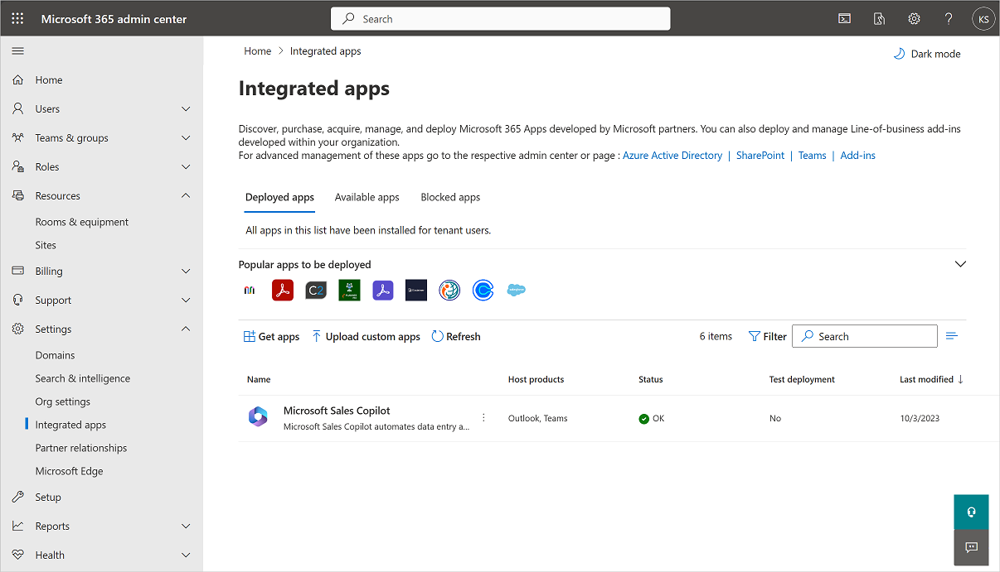
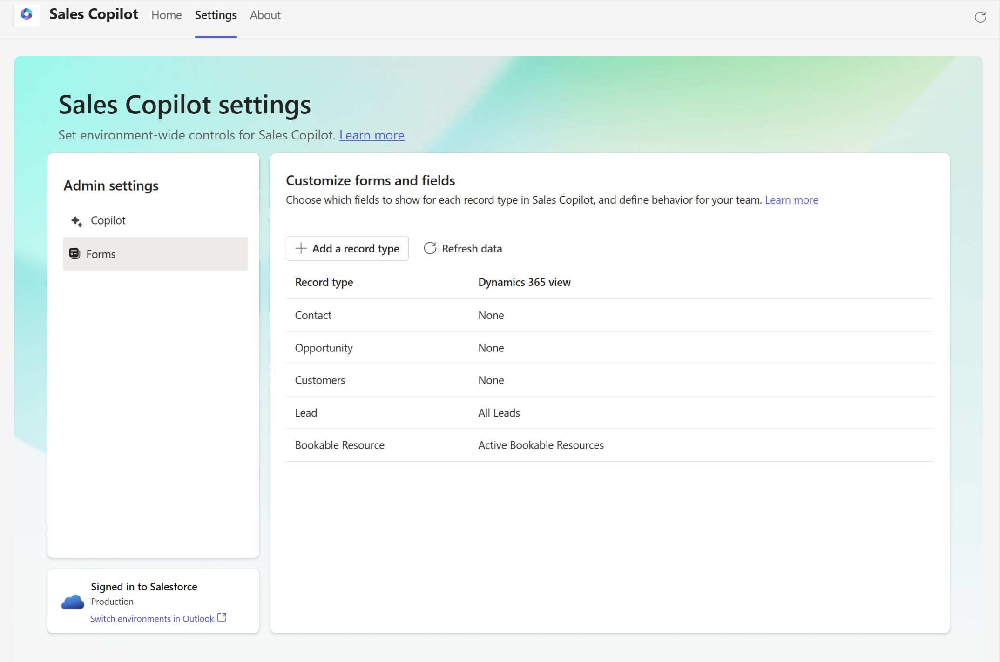
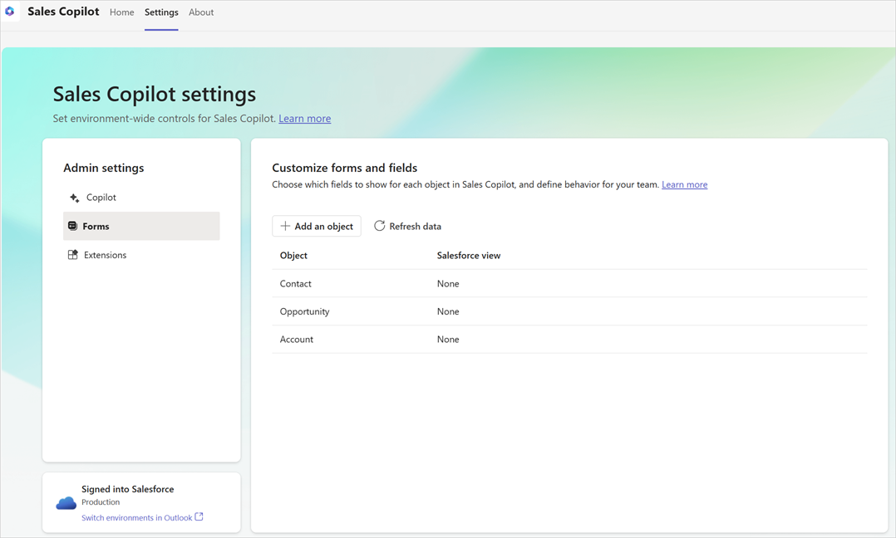
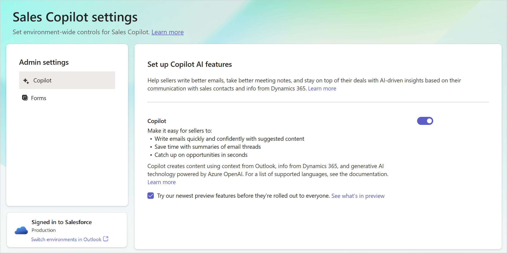

# Sales Copilot deployment guide for Salesforce CRM customers

[!INCLUDE[vs-rebrand-note](includes/vs-rebrand-note.md)]

Follow the instructions in this guide to deploy Sales Copilot for your Salesforce CRM customers. Here's a quick video overview of the steps involved:

> [!VIDEO https://www.microsoft.com/en-us/videoplayer/embed/RW10Mca]

## Prerequisites

- You must be a tenant administrator to install the integrated app from the [Microsoft 365 admin center](https://admin.microsoft.com/). [How do I find my tenant admin?](#how-do-i-find-my-tenant-admin)
- You must be a Teams administrator to create a setup policy in the [Teams admin center](https://admin.teams.microsoft.com/dashboard).

## Step 1: Install and deploy the Sales Copilot Outlook Add-in

[Install Sales Copilot Add-in for Outlook](install-viva-sales-as-an-integrated-app.md)

> [!NOTE]
> It can take up to 24 hours for the add-in to show up for your users.

## Step 2: Create a setup policy to auto install and pin the Sales Copilot app in Teams

[Install and pin Sales Copilot in your sellers' personal Teams environment and meetings they create](install-pin-viva-sales-teams.md)

## Step 3: Enable Teams meeting transcripts

Enable transcripts for Teams calls so that when Sales Copilot is added to a recorded Teams meeting, it can generate a meeting summary.

1.  Sign in to the [Teams admin center](https://admin.teams.microsoft.com).

2.  In the left pane, select **Meetings** &gt; **Meeting policies**.

3.  On the **Manage policies** tab, select **Global (Org-wide default)**.

5.  On the **Global (Org-wide default)** page, scroll down to the **Recording & transcription** section, and turn on the **Transcription** toggle.

6.  Select **Save**.

    

## Step 4: Confirm users have the right security roles

Sales Copilot applies your organization's existing CRM access controls and user permissions. Administrators must have correct permissions to customize their CRM systems, and users must have the correct permissions to view, update, and create records in their CRM systems from Sales Copilot.

Salesforce administrators who need to customize Sales Copilot must have the following permissions. More information: [Privileges required to use Sales Copilot](install-viva-sales.md#privileges-required-to-use-sales-copilot)

|Requirement type|You must have|
|---------------|-------------|
|Permission|User profile needs to have Modify All Data or Manage Data Integrations permission|

## Step 5: Ensure Microsoft Power Platform isn't blocked

Sales Copilot uses the Power Platform connector to connect to Salesforce CRM. Ensure that the connector is enabled for the Sales Copilot users.

1. Sign in to Salesforce CRM as an administrator.

2. Go to **Setup** > **Platform Tools** > **Apps** > **Connected Apps** > **Managed Connected Apps**.

3. Ensure that **Microsoft Power Platform** is listed under **Connected Apps**.

    > [!NOTE]
    > If **Microsoft Power Platform** is not listed under **Connected Apps**, go to the **Connected Apps OAuth Usage** page, and then select **Install** for Microsoft Power Platform.

4. Select **Microsoft Power Platform** to view details about the connected app. 

5. Under **OAuth Policies**, ensure that the value for Permitted Users is set to **Admin approved users are pre-authorized** or **All users may self-authorize**.

    > [!NOTE]
    > If **Admin approved users are pre-authorized** is selected, you must explicitly grant permissions to individual users through policies and permissions sets.

6. Under **Profiles** or **Permission Sets**, check whether there are any existing profiles or permission sets or if they're empty. Check and add the appropriate target for your users.

## Step 6: First user sign in

When the first user in an organization signs in to Salesforce CRM from Sales Copilot, a trial environment needs to be created in Dataverse. As an administrator, you can disable the trial environment creation for non-admin users. In this case, non-admin users will see an error message. For more information on the error message, see [First Salesforce CRM user unable to access Sales Copilot](tsg-trial-env.md).

To avoid this error, it's recommended that the tenant administrator signs in to Salesforce CRM from Sales Copilot first. This creates a trial environment in Dataverse. Once the trial environment is created, other users can sign in to Sales Copilot. For information on how to sign in to Sales Copilot, see [Sign in to CRM](https://support.microsoft.com/topic/use-sales-copilot-in-outlook-ec3605f9-fdb0-4593-9c5b-b43a76c07081#bkmk_vivasales_signin)

## Step 7 (optional): Customize Sales Copilot

[Administrator settings](administrator-settings-for-viva-sales.md) control the seller's Sales Copilot experience in Outlook and Teams. You can customize the CRM fields that are shown on forms and whether Sales Copilot generates suggested email content.

### Customize forms and fields

Sales Copilot comes configured to allow users to be productive out-of-the-box. You can [customize forms and fields](customize-forms-and-fields.md) as needed.

### Set up Copilot AI features

You can [set up AI features in Sales Copilot](suggested-replies.md) to use AI features that are in preview or generally available.

## Step 8: Welcome sellers to Sales Copilot

Now that you've installed and configured Sales Copilot in Outlook and Teams, get your sellers to use it. Here's an example email message you can share.

|  |
|---------|
|**Subject**: Welcome to Sales Copilot!  Dear Sellers,  Welcome to Sales Copilot, a new app that brings CRM data and AI-powered intelligence into your flow of work in Outlook and Teams.  See what Sales Copilot can do for you by [watching this short video](https://www.microsoft.com/en-us/videoplayer/embed/RW181Q4) and taking the [Microsoft Sales Copilot training](/training/modules/boost-sales-performance/).  **Step 1: Logging into Sales Copilot for the first time**  The [Use Sales Copilot in Outlook](https://support.microsoft.com/en-us/topic/use-viva-sales-in-outlook-ec3605f9-fdb0-4593-9c5b-b43a76c07081) article shows you how to find Sales Copilot within Outlook, sign into your CRM system and pin the app pane.  **Additional resources**  The following articles guide you through using various Sales Copilot features: <ul> <li>[Connect a contact to your CRM](https://support.microsoft.com/en-us/topic/connect-a-contact-to-your-crm-5e947640-24ef-48bc-a64d-be0ee32a9990)</li> <li>[Change the connected CRM contact](https://support.microsoft.com/en-us/topic/change-the-connected-crm-contact-b357d535-dc4c-478e-a9c4-7787d1875a82)</li> <li>[Create a contact in your CRM from Sales Copilot](https://support.microsoft.com/en-us/topic/create-a-contact-in-your-crm-from-viva-sales-e0df1aa5-7824-4886-b954-15dc6219ce29)</li> <li>[Save Outlook activities to your CRM](https://support.microsoft.com/en-us/topic/save-outlook-activities-to-your-crm-ee4db5e3-91a5-4d29-b9c2-980959d2fdd7)</li> <li>[View recent and upcoming activities](https://support.microsoft.com/en-us/topic/view-recent-and-upcoming-activities-0f5b4dce-fb99-4c0c-9fbe-37b4be5f343a)</li> <li>[View CRM information](https://support.microsoft.com/en-us/topic/view-crm-information-512861d3-6e23-4eef-a8e5-3e3ed39cd776)</li> <li>[Add personal notes](https://support.microsoft.com/en-us/topic/add-personal-notes-ae382c0c-f0f5-48b7-b3b4-dec456e72fdd)</li> <li>[Share a link to a CRM record](https://support.microsoft.com/en-us/topic/share-a-link-to-a-crm-record-1704ce24-dfd7-45c0-a6a5-8f4e3f33f56d)</li> <li>[Edit a CRM record](https://support.microsoft.com/en-us/topic/edit-a-crm-record-f791a263-3eea-4d01-9211-6b32243617b4)</li> <li>[Use AI to kickstart email replies](https://support.microsoft.com/en-us/topic/use-ai-to-kickstart-email-replies-148708be-e1f9-477c-baba-0b4dd4b7abef)</li> <li>[Use Sales Copilot in Teams](https://support.microsoft.com/en-us/topic/use-viva-sales-in-teams-04286b82-bdf8-4e37-94ce-be1943b2d6ea)</li> <li>[Create a Teams meeting](https://support.microsoft.com/en-us/topic/create-a-teams-meeting-f11d7a0b-654c-4bb7-9939-b053783f306b)</li> <li>[Generate a meeting summary](https://support.microsoft.com/en-us/topic/generate-a-meeting-summary-9dfef995-fb04-46d2-a9cf-bdc29855040b)</li> <li>[View and understand the meeting summary](https://support.microsoft.com/en-us/topic/view-and-understand-the-meeting-summary-020d5bc4-fc84-49ce-a343-fa75ad536b36)</li> <li>[Share a CRM record in a Teams conversation](https://support.microsoft.com/en-us/topic/share-a-crm-record-in-a-teams-conversation-e07cc6b4-9cc7-43ef-905e-b8ff0c8526ed)</li> <li>[View and update CRM record details](https://support.microsoft.com/en-us/topic/view-and-update-crm-record-details-881b506b-9604-4270-9fd7-1a7a8a253997)</li> </ul>**Troubleshooting**  See the [Sales Copilot troubleshooting guide](tsg-no-column.md) article for common problems and solutions.  For additional community help, visit the [Sales Copilot - Microsoft Community Hub](https://techcommunity.microsoft.com/t5/viva-sales/bd-p/VivaSales) page.  For ideas and suggestions, visit the [Microsoft Sales Copilot · Community](https://feedbackportal.microsoft.com/feedback/forum/7fcacc26-460c-ed11-b83d-000d3a4d91d1) page.     |

## Community

We encourage all Sales Copilot users to visit and register on the [Sales Copilot community](https://techcommunity.microsoft.com/t5/viva-sales/bd-p/VivaSales). The community has:

-   Forums to connect with peers and discuss shared experiences.

-   Forums to contribute and receive support on common issues, which are routinely reviewed by our team of experts.

-   Spaces to [share ideas](https://feedbackportal.microsoft.com/feedback/forum/7fcacc26-460c-ed11-b83d-000d3a4d91d1) and engage with the product development team.

## FAQ

### Is Sales Copilot available for Salesforce CRM customers?

Sales Copilot is a generally available app for Salesforce CRM customers, [watch this short video to learn more](https://www.youtube.com/watch?v=hfDPogeGTHk).

A Microsoft 365 for Enterprise or Office 365 for Enterprise product license is required to use the Sales Copilot app in Outlook and Microsoft Teams.

### How does Sales Copilot work?

Sales Copilot uses an Outlook add-in and a Teams app to bring the context of your CRM into your sellers' workflows. [Learn more about Microsoft Sales Copilot](https://www.microsoft.com/microsoft-viva/sales).

### Is Sales Copilot safe and secure?

Sales Copilot is a certified Microsoft app. That means it meets our rigorous security and compliance standards.

Get information about license requirements, role requirements, and region availability in [Introduction to Microsoft Sales Copilot](introduction.md) and [Sales Copilot FAQ](https://support.microsoft.com/topic/viva-sales-faq-dd0b9203-a5d4-44ee-a173-cadc808c828a).

### How do I find my tenant admin?

[How to find your Microsoft 365 admin](https://support.microsoft.com/en-us/office/how-do-i-find-my-microsoft-365-admin-59b8e361-dbb6-407f-8ac3-a30889e7b99b).

You may also find your tenant admin's email address on the [Azure Active Directory admin center tenant properties page](https://aad.portal.azure.com/#view/Microsoft_AAD_IAM/ActiveDirectoryMenuBlade/~/Properties), if an administrator hasn't locked it down.

### Are there any special browser settings needed to use Sales Copilot in the web versions of Outlook and Teams?

Users may need to change a few settings to get the best experience of Sales Copilot in Outlook and Teams on the web.

- **Edge**:
  - Turn on "Enable sites to save and read cookie data (recommended)."
  - Turn off "Block third-party cookies."

- **Safari**: Turn off "Prevent Cross-site tracking."

- **Chrome**: Turn off "Block third-party cookies."

The [Sales Copilot troubleshooting guide](https://support.microsoft.com/en-us/topic/update-add-in-error-in-viva-sales-for-microsoft-outlook-bbc41354-113a-4eda-86aa-9c338954a559) can help with solutions for common issues.

