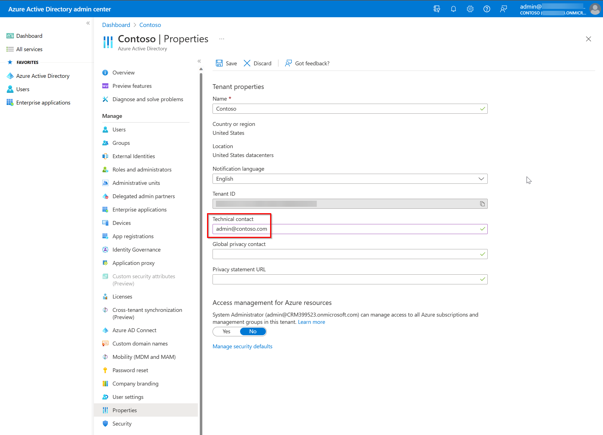

# Microsoft Copilot for Sales FAQ

We've compiled a list of frequently asked questions and provided brief answers to help you get the required information quickly.

## General

### What is Copilot for Sales?  

Microsoft Copilot for Sales brings together the power of Copilot for Microsoft 365 with seller workflows. Microsoft Copilot for Sales leverages data from their CRM platform, as well as large language models and data from Microsoft Graph, Microsoft 365 apps, and the internet. Copilot for Sales helps sales teams save time and energy, generate innovative ideas, build stronger customer relationships and ultimately close more deals.   

Some of the new innovations enabled in Copilot for Sales include a newly integrated experience with Microsoft Word and Microsoft Teams.  Sellers can prompt Copilot to create a meeting preparation brief in Microsoft Word, automatically populated with customer information such as an account and opportunity summary, names and titles of meeting participants, open tasks, highlights from recent meetings and email threads, and more. In addition, meeting recaps in Microsoft Teams can surface action items and tasks, conversation key performance indicators (KPIs), and sales keywords. Sellers can also customize AI-assisted sales processes with Copilot Studio, bringing tailored experiences informed by their own data, logic and actions for specific scenarios. 

Copilot for Sales includes the Copilot for Microsoft 365 subscription and will be available February 1, 2024. [See our pricing page for more information](https://www.microsoft.com/ai/microsoft-sales-copilot#featuresandpricing). 

### How does Copilot for Sales work?

Copilot for Sales uses an Outlook add-in and a Teams app to bring the context of your CRM into your sellers' workflows. [Learn more about Microsoft Copilot for Sales](https://www.microsoft.com/ai/microsoft-sales-copilot).

### Is Copilot for Sales safe and secure?

Copilot for Sales is a certified Microsoft app. That means it meets our rigorous security and compliance standards. See [Security, Privacy and Compliance](#security-privacy-and-compliance) for more information.

Get information about license requirements, role requirements, and region availability in [Introduction to Microsoft Copilot for Sales](introduction.md).

## Licensing

### When is Microsoft Copilot for Sales available for purchase?

Copilot for Sales includes the Copilot for Microsoft 365 subscription and will be available to purchase on February 1, 2024 on the Volume Licensing and Web Direct Channel. Copilot for Sales will be available to purchase on CSP from March 1, 2024. Copilot for Sales includes the rich sales specific capabilities alongside Microsoft Copilot for Microsoft 365. It's priced at $50 per user/month, or $20 per user/month if the customer already has Copilot for Microsoft 365. [See our pricing page for more information](https://www.microsoft.com/ai/microsoft-sales-copilot#featuresandpricing). 

:::image type="content" source="media/license-details.png" alt-text="Screenshot showing license details." lightbox="media/license-details.png":::

### Will Copilot for Sales be included in Dynamics 365 Sales subscriptions?

No, Copilot for Sales (premium) won't be included in any Dynamics 365 Sales subscriptions, as it includes Copilot for Microsoft 365 (for example, Copilot in PowerPoint, Copilot in Word, and more). 

Dynamics 365 Sales Premium customers can unlock Copilot for Sales with an additional purchase of Copilot for Microsoft 365. The sales capabilities are activated when a user has Sales Premium and Microsoft Copilot for Microsoft 365 associated to their user profile. All other Dynamics 365 Sales customers must purchase the Copilot for Sales subscription to get the full power of the product.  

Note that Dynamics 365 Sales customers (Enterprise and Premium) will continue to have access to standard functionality (formerly known as Viva Sales or Sales Copilot) without purchasing Copilot for Sales. See the chart above for the included features.

### How does the new Copilot for Sales affect Dynamics 365 Sales? Is there any change in capability or licensing for Dynamics 365 Sales customers?  

There's no change or impact. 

Dynamics 365 Sales Enterprise and Premium licenses will still include Copilot capabilities in the Dynamics 365 Sales platform (for example, meeting preparation summary in Dynamics 365), as well as a standard set of Copilot for Sales capabilities in Outlook and Teams, which mirror the Sales Copilot capabilities today such as email generation in Outlook, email summary in Outlook, contact updates in Outlook.  

We will continue to innovate on Copilot experiences in the Dynamics 365 Sales platform, such as the [announcements at Ignite](https://aka.ms/Ignite2023BAannounceblog) for natural language support in Dynamics 365 Sales. Customers can use this functionality without purchasing Copilot for Sales. 

Future innovation in Copilot across the Microsoft 365 apps will require purchase of Copilot for Sales. For more detail, see the license chart above which highlights all of the current Copilot functionality that is included in Dynamics 365 Sales licenses.  

### What happens to the standalone Microsoft Sales Copilot subscription? What happens to the customers who purchased that standalone subscription?  

Microsoft Copilot for Sales subscription replaces the Microsoft Sales Copilot subscription. The capabilities in Sales Copilot will continue to be available and further enhanced with the power of Copilot for Microsoft 365, under the new Copilot for Sales subscription. The integration with Word and enhanced integration with Teams are just some examples of the innovations to come.

We appreciate the customers that have invested early in the standalone Sales Copilot subscriptions. They can remain on their existing subscriptions with access to the current functionality during their contracts. If they wish to try the new capabilities in Copilot for Sales, they must make the move to the new license model.

## Availability

### What languages will Microsoft Copilot for Sales support? 

There are no changes to [country/region availability or languages](supported-languages.md) with the evolution from Microsoft Sales Copilot to Copilot for Sales, except for Copilot for Microsoft 365, which can be found in [this blog](https://techcommunity.microsoft.com/t5/microsoft-365-copilot/microsoft-365-copilot-is-generally-available/ba-p/3969331).  

### What geographies will Microsoft Copilot for Sales support?   

Copilot in Outlook and Teams is available in these [supported geographies](introduction.md#region-availability).  

Copilot for Microsoft 365 isn't currently available in local region geographies. Refer to the [public roadmap](https://www.microsoft365.com/roadmap) for the most current information.  

### Will Microsoft Copilot for Sales be available for US GCC, GCC High, or DoD?  

Currently, Microsoft Copilot for Sales isn't supported under US GCC, GCC High, or DoD or any other Sovereign cloud. Copilot for Microsoft 365 is expected to begin rollout in GCC later in 2024. We plan to share more on availability for GCC High and DoD through the [Microsoft 365 roadmap](https://www.microsoft.com/microsoft-365/roadmap) in early 2024.

## Skilling

### How can I learn about Microsoft Copilot for Sales?  

Customers can access existing Microsoft Sales Copilot and Microsoft Copilot for Microsoft 365 content through Microsoft Learn. Content will be refreshed in 2024 to align to the new naming and licensing structure. [View our adoption webpage for access to further materials](https://adoption.microsoft.com/copilot-for-sales/).

### How can I get certified in Microsoft Copilot for Sales? 

There currently aren't any certifications for Microsoft Copilot for Sales, but all Microsoft’s learning content is in the process of being refreshed with additional Copilot features. You'll first see technical skilling content on Microsoft Learn.

## Functionality

### How does Copilot work?  

Copilot works by harnessing the power of foundational models, proprietary Microsoft technologies and customer business data. Search technologies like Bing and Azure Cognitive Search bring domain-specific context to Copilot from content like manuals and documents stored in customer’s own tenant. Microsoft applications like Dynamics 365 and Power Platform bring crucial context with data stored in Microsoft Dataverse. Finally, Microsoft Graph API provides additional context from sources such as emails, chats, documents, meetings etc. 

Every time a customer uses Copilot to perform a task, three things happen. 

Copilot receives an input prompt from a business user in an application. For example, if a user prompts Copilot with "Show me recent news about ABC Corp." Copilot then preprocesses the prompt using an approach called grounding which uses enterprise data stored in Microsoft Graph and Dataverse. Grounding improves specificity and helps deliver relevant responses.  

Next, the enriched prompt is sent to an appropriate LLM (large language model). The LLM returns a response, and Copilot then postprocesses this response, which includes additional grounding calls to customer data, responsible AI checks, security, compliance, and privacy reviews. 

Then, Copilot returns this recommended response to the business user via a command back to the application who then assesses before choosing to use it. 

### Who can install Copilot for Sales?

Microsoft 365 administrators can install Copilot for Sales and assign users/security groups to use it.

### Does Copilot for Sales require CRM connectivity?

Yes, Copilot for Sales requires connectivity to a CRM.

### Which CRMs work with Copilot for Sales?

Currently, Copilot for Sales is compatible with Dynamics 365 Sales and Salesforce Sales Cloud.

> [!NOTE]
> Salesforce Sales Cloud is a trademark of Salesforce, Inc.

### What privileges are required to use Copilot for Sales?

Copilot for Sales applies your organization's existing CRM access controls and user permissions. More information: [Privileges required to use Copilot for Sales](install-viva-sales.md#privileges-required-to-use-copilot-for-sales).

### I don't see an email summary when opening an email conversation.

Email summary is generated only for emails or email threads with more than 1000 characters, which is about 180 words.

### I don't see the Summarize a sales meeting button when creating a sales meeting summary email.

The **Summarize a sales meeting** button isn't available in the following scenarios:

- There are no meetings transcribed.

- Meetings are filtered as per the recipients entered in the **To** list. If there are no meetings transcribed with the people in the **To** list, a message is displayed conveying the same.

- Due to network or connection error. Try closing and reopening the Copilot for Sales pane.

For information on how to transcribe a meeting, see [Generate a meeting summary.](generate-meeting-summary.md)

### With which Salesforce Sales Cloud editions does Copilot for Sales work?

Copilot for Sales works with Salesforce Sales Cloud editions Professional and above.

> [!NOTE]
> Salesforce Sales Cloud is a trademark of Salesforce, Inc.

### Is Copilot for Sales available for Dynamics 365 or Microsoft Exchange on premise?

Copilot for Sales isn't available for Dynamics 365 or Microsoft Exchange on premise.

### Does Copilot for Sales work for Power Apps or Dataverse customers without Dynamics 365 licenses?

Copilot for Sales works for Microsoft 365 customers with an eligible license and a CRM (Dynamics 365 or Salesforce).

### Does Copilot for Sales work in incognito mode?

When you use the Copilot for Sales app in incognito mode or you have disabled third-party cookies, the following message is displayed:

:::image type="content" source="media/incognito.png" alt-text="Screenshot showing message in incognito mode.":::

When you search for a record in Copilot for Sales pane in Outlook, the record type filter might not work properly.

This is normal behavior. The reason for this is that Copilot for Sales uses cookies to save data to local storage. In incognito mode or when third-party cookies are disabled, access to local storage is blocked.

To get full benefit of all features in Copilot for Sales, browse in normal mode and allow Microsoft domain in third-party cookie settings.

For information about how to allow third-party cookies, see:

- [Enable cookies in Microsoft Edge](https://support.microsoft.com/office/enable-cookies-6b018d22-1d24-43d9-8543-3d35ddb2cb52)

- [Clear, allow & manage cookies in Chrome](https://support.google.com/chrome/answer/95647)

- [Enable cookies in Safari](https://support.apple.com/guide/safari/ibrw850f6c51/mac)

### How can I add the Copilot for Sales app manually to a Teams meeting?

You can add the Copilot for Sales app manually to a Teams meeting to test it internally before scheduling a call with your customer.

- To add an app before a meeting, first send the meeting invite then open the meeting. Select **Add a tab **(**+**), search for Copilot for Sales, and then select it.

    :::image type="content" source="media/add-before-meeting.png" alt-text="Screenshot showing add Copilot for Sales app before meeting.":::

- To add an app during a meeting, after the meeting starts select **Add an app** (**+**), search for Copilot for Sales, and then select it.

    :::image type="content" source="media/add-during-meeting.png" alt-text="Screenshot showing add Copilot for Sales app during meeting.":::

### What's the minimum version of Outlook required for Copilot for Sales?

The minimum required version for Outlook is:

- **Outlook for Windows**: version 2206 (Build 15330.20196)

- **Outlook for Mac**: 16.78

### Why are meeting insights not getting generated even if meeting is transcribed?

Meeting insights are generated only if version of the Copilot for Sales app in Microsoft Teams is 1.0.9 or higher. To check your app's version:

1. Open Microsoft Teams and select **Copilot for Sales** in the navigation bar on the left.

1. In the Copilot for Sales app, go to the **About** tab and check the version.

If the Copilot for Sales app for Teams is installed by your administrator, you must contact your administrator to update the app to the latest version.

If you've installed Copilot for Sales app for Teams by yourself, you can update it to the latest version by following the instructions [here](https://support.microsoft.com/office/update-an-app-3d53d136-5c5d-4dfa-9602-01e6fdd8015b).

### How many hours of conversational intelligence are available with Copilot for Sales?

You get unlimited call recording and processing hours with Copilot for Sales.

### Are there any special browser settings needed to use Copilot for Sales in the web versions of Outlook and Teams?

Users may need to change a few settings to get the best experience of Copilot for Sales in Outlook and Teams on the web.

- **Edge**:
  - Turn on "Enable sites to save and read cookie data (recommended)."
  - Turn off "Block third-party cookies."

- **Safari**: Turn off "Prevent Cross-site tracking."

- **Chrome**: Turn off "Block third-party cookies."

### Why do I see the older icon for Copilot for Sales in Outlook desktop?

In some cases, you may see the older icon for Copilot for Sales in Outlook desktop. 

:::image type="content" source="media/faq-older-icon.png" alt-text="Older icon of Copilot for Sales":::

To see the new icon, you must clear the Outlook cache by following these steps:

1. Close Outlook, and then run the following commands to delete the cache files. Ensure to replace `<alias>` with your alias.
    - `rmdir /s /q "C:\Users\<alias>\AppData\Local\microsoft\office\16.0\ResourceInfoCache"`
    - `rmdir /s /q "C:\Users\<alias>\AppData\Local\Microsoft\Outlook\HubAppCache"`
    - `rmdir /s /q "C:\Users\<alias>\AppData\Local\Microsoft\Outlook\HubAppFileCache"`
    - `rmdir /s /q "C:\Users\<alias>\AppData\Local\Microsoft\Office\16.0\Wef"`

1. Open Outlook.

### How can I provide feedback about Copilot for Sales?

You can go to the [feedback portal](https://feedbackportal.microsoft.com/feedback/forum/7fcacc26-460c-ed11-b83d-000d3a4d91d1) to suggest a feature. You can also join the [Tech Community](https://techcommunity.microsoft.com/t5/viva-sales/bd-p/VivaSales) forum to interact with the product team and other users of Copilot for Sales.

## Deployment

### How do I find my tenant admin?

[How to find your Microsoft 365 admin](https://support.microsoft.com/en-us/office/how-do-i-find-my-microsoft-365-admin-59b8e361-dbb6-407f-8ac3-a30889e7b99b).

You may also find your tenant admin's email address on the [Microsoft Entra admin center tenant properties page](https://entra.microsoft.com/#view/Microsoft_AAD_IAM/TenantOverview.ReactView), if an administrator hasn't locked it down.

### Why can't users see the Copilot for Sales app in Outlook after it's deployed?

After you deploy the Copilot for Sales app from the Microsoft 365 admin center, it can take up to 48 hours for the app to appear in Outlook and other Microsoft 365 apps. If the app doesn't appear after 48 hours, ensure that the public attachment handling is enabled for your mailbox policy. This policy blocks the display of the enhanced Teams apps within Microsoft 365 apps. For instructions to enable public attachment handling, see [Public attachment handling in Exchange Online](/exchange/clients-and-mobile-in-exchange-online/outlook-on-the-web/public-attachment-handling#task-3---enable-public-attachment-handling-on-an-outlook-on-the-web-mailbox-policy).

Ensure that the following settings are set to true:

- WacViewingOnPublicComputersEnabled
- WacViewingOnPrivateComputersEnabled
- DirectFileAccessOnPublicComputersEnabled
- DirectFileAccessOnPrivateComputersEnabled

### Why do users see duplicate icons for Copilot for Sales in Outlook desktop?

Users may see duplicate icons for Copilot for Sales due to a recent update to the enhanced Teams apps to support integration of the older Outlook add-in. As an administrator, you must merge the older add-in with the new enhanced Teams app from Microsoft 365 admin center.

1.  In the [Microsoft 365 admin center](https://admin.microsoft.com/), select **Settings** &gt; **Integrated apps**.

1.  On the **Integrated apps** page, select the **Microsoft Copilot for Sales** app.

    The **Microsoft Copilot for Sales** panel opens. A message is displayed in the **Overview** tab to merge the older add-in with the new enhanced Teams app.

1. Select **Merge both versions** and accept the permissions.

    :::image type="content" source="media/faq-duplicate-icons.png" alt-text="Merge versions of Copilot for Sales.":::

    After the merge is complete, users will see only one icon for Copilot for Sales in Outlook desktop. It may take a few hours for the changes to take effect.
   
## Forms and fields customization

### Are changes in the CRM reflected automatically in Copilot for Sales?

Changes made in the CRM aren't reflected automatically in Copilot for Sales. You must select **Refresh data** on the **Customize forms and fields** page to get the latest updates from the CRM. More information: [Refresh data](#refresh-data-from-crm)

### Why is the delete option disabled for some fields in the contact record?

If you enable new contact creation from within Copilot for Sales, you can't remove a field from the contact form if it's marked as required in CRM.

### Which fields can't be customized?

The following fields can't be added from the Copilot for Sales **Admin settings** page:

**Dynamics 365**

-   Fields of type File, Image, Rich text, or MultiSelect Option Set.

-   Entity Id

-   All fields where [**IsValidODataAttribute**](/dotnet/api/microsoft.xrm.sdk.metadata.attributemetadata.isvalidodataattribute?view=dataverse-sdk-latest&preserve-view=true) is set to false. 

**Salesforce**

-   Fields of type Geolocation, Text area (rich), Text area (encrypted), External Lookup Relationship, or Picklist (Multi-Select).

-   Entity Id

### How many fields can I add to a record?

You can add a maximum of 40 fields to a record.

### Why are some fields non-editable, although the record is set as editable?

A field can be noneditable in the following cases:
- The field is calculated
- The field is required in the CRM

### How are hyperlink formula fields from Salesforce CRM displayed in Copilot for Sales?

In Salesforce CRM, hyperlink formula fields are rendered as rich text in Salesforce Lightning, allowing users to click on the link. In Copilot for Sales, hyperlink formula fields containing URLs (but no images) are displayed as clickable links.

### Why are users getting an error with error code 4100 when viewing a CRM record?

If you've connected Copilot for Sales to Salesforce, and your users see a 4100 error when viewing a CRM record, they don't have access to some of the fields added to be displayed. Ensure that all users of the app have access to the fields added to a CRM record.

### Why don't I see the desired relationship for a record type during configuration?

The relationship between record types is based on the order in which record types are added to admin settings. Ensure that the source record type is configured before the related record type. If the relationship is not displayed, reorder the record types in admin settings. More information: [Impact of the order of record types on relationships](customize-forms-and-fields.md#impact-of-the-order-of-record-types-on-relationships)

## Security, Privacy and Compliance 

### How does Microsoft protect customer data privacy? 

Microsoft is uniquely positioned to deliver enterprise-ready AI. Powered by Azure OpenAI Service, Copilot features built-in responsible AI and enterprise-grade Azure security. 

1. Built on Microsoft's comprehensive approach to security, compliance, and privacy 

    Copilot is integrated into Microsoft services like Dynamics 365, Microsoft Power Platform, and Microsoft 365, and automatically inherits all the customer’s valuable security, compliance, and privacy policies and processes. Two-factor authentication, compliance boundaries, privacy protections, and more make Copilot the AI solution customers can trust. 

1. Architected to protect tenant, group, and individual data 

    We know data leakage is a concern for customers. LLMs aren't further trained on, or learn from, customer tenant data or user prompts. Within the customer’s own tenant, our time-tested permissions model provides safeguards and enterprise-grade security as seen in our Azure offerings. And on an individual level, Copilot presents only data one can access using the same technology that we’ve been using for years to secure customer data. 

1. Designed to learn new skills 

    Copilot’s foundation skills are a game changer for productivity and business processes. The capabilities allow you to create, summarize, analyze, collaborate, and automate using your specific business content and context. But it doesn’t stop there. Copilot recommends actions for the user (for example, “create a time and expense application to enable employees to submit their time and expense reports”). And Copilot is designed to learn new skills. For example, Copilot can learn how to connect to CRM systems of record to pull customer data—like interaction and order histories—into communications. As Copilot learns about new domains and processes, it will be able to perform even more sophisticated tasks and queries. 

### How will Microsoft use customer data to train Copilot for Sales?  

Copilot unlocks business value by connecting LLMs to the customer’s own business data in a secure, complaint, privacy-preserving way. 

Copilot generates answers anchored in real-time business content (customer's own documents, emails, calendar, chats, meetings, contacts, and other business data) and combines them with working context, the meeting the user is in now, the email exchanges had on a topic, the chat conversations had last week, and  to deliver accurate, relevant, contextual responses. 

Microsoft, however, doesn't use customers' data to train LLMs. We believe the customers’ data is their data, aligned to [Microsoft's data privacy policy](https://aka.ms/privacy). AI-powered LLMs are trained on a large but limited corpus of data. Prompts, responses, and data accessed through Microsoft Graph and Microsoft services aren't used to train Microsoft Copilot for Sales capabilities for use by other customers. Furthermore, the foundation models aren't improved through usage of Copilot by individual customers. This means the customer’s own data is accessible only by authorized users within their organization unless the customer explicitly consents to other access or use. 

### How will Copilot for Sales manage GDPR policies?  

Copilot for Sales complies with GDPR policies.

The Dynamics App for Outlook is strictly an enablement app that bridges the gap between outlook and DV data. The app isn't being invested in, but rather we're focusing on bringing critical enablement features to the Copilot for Sales App in addition to all of the empowerment features related to generative AI and insights to help sellers get the job done in the context of their work in Outlook. Sellers should encourage their customers to migrate to the Copilot for Sales app to take advantage of our innovation and investments (two existing gaps, entity creation and entity global search are being worked on and should be delivered in the first quarter of 2024).

## Resources 

- [Copilot for Microsoft 365 FAQ](https://support.microsoft.com/office/frequently-asked-questions-about-microsoft-365-copilot-500fc65e-9973-4e42-9cf4-bdefb0eb04ce)
- [Microsoft Copilot for Sales GA blog](https://cloudblogs.microsoft.com/dynamics365/bdm/2024/02/01/microsoft-copilot-for-sales-and-copilot-for-service-are-now-generally-available/)
- [Ignite announcements blog](https://aka.ms/Ignite2023BAannounceblog)
- [Copilot for Sales Adoption page](https://adoption.microsoft.com/en-us/copilot-for-sales/)
