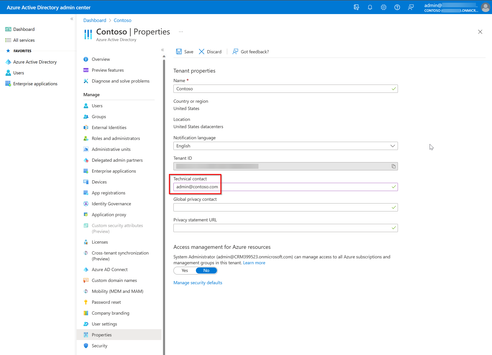

#  Sales agent FAQ

We've compiled a list of frequently asked questions and provided brief answers to help you get the required information quickly. Use this article to quickly find answers by task:

- [Get started and licensing](#general)
- [Check availability and geographies](#availability)
- [Fix common feature issues](#functionality)
- [Configure admin settings](#admin-settings)
- [Deploy and troubleshoot deployment](#deployment)
- [Customize forms and fields](#forms-and-fields-customization)
- [Use Sales agent in Microsoft 365 Copilot](#sales-agent-in-microsoft-365-copilot)
- [Review security, privacy, and compliance](#security-privacy-and-compliance)

## General

### What is Sales agent?  

Sales agent combines Microsoft 365 Copilot with everyday seller workflows. It uses data from your CRM system, Microsoft Graph, Microsoft 365 apps, large language models, and relevant web sources to deliver helpful, contextual insights. With this connected experience, sales teams can save time, work more efficiently, strengthen customer relationships, and close more deals.

Sales agent also provides integrated experiences in Outlook and Teams. In Outlook, it can summarize email threads and suggest reply drafts so sellers can respond faster and more effectively. In Teams, meeting recaps can highlight action items, key tasks, conversation KPIs, and sales-related keywords. Sellers can further tailor these AI-assisted workflows by using Copilot Studio to apply their own business data, logic, and actions for specific scenarios.

### How does Sales agent work?

Sales agent uses an Outlook add-in and a Teams app to bring the context of your CRM into your sellers' workflows. [Learn more about Sales agent](https://www.microsoft.com/ai/microsoft-sales-copilot).

### Is Sales agent safe and secure?

Sales agent is a certified Microsoft app. That means it meets our rigorous security and compliance standards. See [Security, Privacy, and Compliance](#security-privacy-and-compliance) for more information.

Get information about license requirements, role requirements, and region availability in [Introduction to Sales agent](introduction.md).

## Availability

### What geographies will Sales agent support?   

For the list of supported languages and geographies, see the [Copilot international availability report](https://releaseplans.microsoft.com/availability-reports/?report=copilotproductreport).  

Microsoft 365 Copilot isn't currently available in local region geographies. Refer to the [public roadmap](https://www.microsoft365.com/roadmap) for the most current information.  

### Will Sales agent be available for US GCC, GCC High, or DoD?  

Currently, Sales agent isn't supported in US GCC, GCC High, or DoD or any other Sovereign cloud.

## Skilling

### How can I get certified in Sales agent? 

There currently aren't any certifications for Sales agent, but all Microsoft’s learning content is in the process of being refreshed with additional Copilot features. You'll first see technical skilling content on Microsoft Learn.

## Functionality

### How does Copilot work?  

Copilot works by harnessing the power of foundational models, proprietary Microsoft technologies, and customer business data. Search technologies like Bing and Azure Cognitive Search bring domain-specific context to Copilot from content like manuals and documents stored in customer’s own tenant. Microsoft applications like Dynamics 365 and Power Platform bring crucial context with data stored in Microsoft Dataverse. Finally, Microsoft Graph API provides additional context from sources such as emails, chats, documents, meetings etc. 

Every time a customer uses Copilot to perform a task, three things happen. 

Copilot receives an input prompt from a business user in an application. For example, if a user prompts Copilot with "Show me recent news about ABC Corp." Copilot then preprocesses the prompt using an approach called grounding which uses enterprise data stored in Microsoft Graph and Dataverse. Grounding improves specificity and helps deliver relevant responses.  

Next, the enriched prompt is sent to an appropriate LLM (large language model). The LLM returns a response, and Copilot then postprocesses this response, which includes additional grounding calls to customer data, responsible AI checks, security, compliance, and privacy reviews. 

Then, Copilot returns this recommended response to the business user via a command back to the application who then assesses before choosing to use it. 

### Who can install Sales agent?

Microsoft 365 administrators can install Sales agent and assign users/security groups to use it.

### Does Sales agent require CRM connectivity?

Yes, Sales agent requires connectivity to a CRM.

### Which CRMs work with Sales agent?

Currently, Sales agent is compatible with Dynamics 365 Sales and Salesforce Sales Cloud.

> [!NOTE]
> Salesforce Sales Cloud is a trademark of Salesforce, Inc.

### What privileges are required to use Sales agent?

Sales agent applies your organization's existing CRM access controls and user permissions. More information: [Privileges required to use Sales agent](privileges.md).

### I don't see an email summary when opening an email conversation.

Email summary is generated only for emails or email threads with more than 1,000 characters, which is about 180 words.

### I don't see the Summarize a sales meeting button when creating a sales meeting summary email.

If **Summarize a sales meeting** isn't available, check these items:

- Confirm at least one meeting is transcribed.  
   See [Generate a meeting summary](create-teams-meeting.md#generate-a-meeting-summary).
- Verify the **To** recipients match participants from a transcribed meeting.
- Close and reopen the **Sales** pane to recover from connection issues.

### Which Salesforce Sales Cloud editions are supported by Sales agent?

Sales agent works with Salesforce Sales Cloud editions Professional and above.

> [!NOTE]
> Salesforce Sales Cloud is a trademark of Salesforce, Inc.

### Is Sales agent available for Dynamics 365 or Microsoft Exchange on premise?

Sales agent isn't available for Dynamics 365 or Microsoft Exchange on premise.

### Does Sales agent work for Power Apps or Dataverse customers without Dynamics 365 licenses?

Sales agent works for Microsoft 365 customers with an eligible license and a CRM (Dynamics 365 or Salesforce).

### Does Sales agent work in incognito mode?

When you use the Sales agent app in incognito mode or you have disabled third-party cookies, the following message is displayed:

:::image type="content" source="media/incognito.png" alt-text="Screenshot showing message in incognito mode.":::

When you search for a record in the **Sales** pane in Outlook, the record type filter might not work properly.

This is normal behavior. The reason for this is that Sales agent uses cookies to save data to local storage. In incognito mode or when third-party cookies are disabled, access to local storage is blocked.

To get full benefit of all features in Sales agent, browse in normal mode and allow Microsoft domain in third-party cookie settings.

For information about how to allow third-party cookies, see:

- [Enable cookies in Microsoft Edge](https://support.microsoft.com/office/enable-cookies-6b018d22-1d24-43d9-8543-3d35ddb2cb52)

- [Clear, allow & manage cookies in Chrome](https://support.google.com/chrome/answer/95647)

- [Enable cookies in Safari](https://support.apple.com/guide/safari/ibrw850f6c51/mac)

### How can I add the Sales agent manually to a Teams meeting?

You can add the Sales agent manually to a Teams meeting to test it internally before scheduling a call with your customer.

- To add an app before a meeting, first send the meeting invite then open the meeting. Select **Add a tab **(**+**), search for Sales, and then select it.

    :::image type="content" source="media/add-before-meeting.png" alt-text="Screenshot showing add the Sales agent before meeting.":::

- To add an app during a meeting, after the meeting starts select **Add an app** (**+**), search for Sales, and then select it.

    :::image type="content" source="media/add-during-meeting.png" alt-text="Screenshot showing add the Sales agent during meeting.":::

### What's the minimum version of Outlook required for Sales agent?

The minimum required version for Outlook is:

- **Outlook for Windows**: version 2206 (Build 15330.20196)

- **Outlook for Mac**: 16.78

### Why are meeting insights not getting generated even if meeting is transcribed?

Meeting insights are generated only if version of the Sales agent in Microsoft Teams is 1.0.9 or higher. To check your app's version:

1. Open Microsoft Teams and select **Sales** in the navigation bar on the left.

1. In the Sales agent, go to the **About** tab and check the version.

If the Sales agent for Teams is installed by your administrator, you must contact your administrator to update the app to the latest version.

If you've installed the Sales agent for Teams by yourself, you can update it to the latest version by following the instructions [here](https://support.microsoft.com/office/update-an-app-3d53d136-5c5d-4dfa-9602-01e6fdd8015b).

### How many hours of conversational intelligence are available with Sales agent?

You get unlimited call recording and processing hours with Sales agent.

### Are there any special browser settings needed to use Sales agent in the web versions of Outlook and Teams?

Users may need to change a few settings to get the best experience of Sales agent in Outlook and Teams on the web.

- **Edge**:
  - Turn on "Enable sites to save and read cookie data (recommended)."
  - Turn off "Block third-party cookies."

- **Safari**: Turn off "Prevent Cross-site tracking."

- **Chrome**: Turn off "Block third-party cookies."

### Why do I see the older icon for Sales agent in Outlook desktop?

In some cases, you might see the older icon for the Sales agent in Outlook desktop.

:::image type="content" source="media/faq-older-icon.png" alt-text="Older icon of the Sales agent":::

To see the new icon, you must clear the Outlook cache by following these steps:

1. Close Outlook, and then run the following commands to delete the cache files. Ensure to replace `<alias>` with your alias.
    - `rmdir /s /q "C:\Users\<alias>\AppData\Local\microsoft\office\16.0\ResourceInfoCache"`
    - `rmdir /s /q "C:\Users\<alias>\AppData\Local\Microsoft\Outlook\HubAppCache"`
    - `rmdir /s /q "C:\Users\<alias>\AppData\Local\Microsoft\Outlook\HubAppFileCache"`
    - `rmdir /s /q "C:\Users\<alias>\AppData\Local\Microsoft\Office\16.0\Wef"`

1. Open Outlook.

### How do optional connected experiences affect Sales agent?

If your organization has disabled the [optional connected experiences](/microsoft-365-apps/privacy/optional-connected-experiences#admin-controls-for-optional-connected-experiences) policy, the Sales agent isn't displayed in Outlook for users that have installed the app by themselves. If the Sales agent has been deployed by an administrator, it is displayed for users.

### How can I provide feedback about Sales agent?

You can go to the [feedback portal](https://feedbackportal.microsoft.com/feedback/forum/7fcacc26-460c-ed11-b83d-000d3a4d91d1) to suggest a feature. You can also join the [Tech Community](https://techcommunity.microsoft.com/t5/viva-sales/bd-p/VivaSales) forum to interact with the product team and other users of Sales agent.

## Admin settings

### Which CRM environment do the administrator settings apply to?

The settings are specific to the environment you're signed in to in the Sales agent in Outlook. If you want to customize the Sales agent for another environment, you must [switch to that environment in Outlook](#how-can-i-switch-crm-environments).

### How can I switch CRM environments?

If your organization provides multiple environments for you and your sellers to work in, make sure you're signed in to the right one in Outlook before you change any settings in Teams. If you need to change a setting in a different environment, switch to that environment first either in [Outlook](more-options.md#switch-environments-or-crm) or [Teams](personal-app.md#switch-environments).

### Why do I see the message "Settings are coming soon"?

You signed in to the Sales agent in Outlook or Teams with an account that doesn't have admin rights. Personal settings for the Sales agent will be accessible in the **Settings** tab soon.

If you're signed in with tenant administrator or CRM administrator credentials, you shouldn't see the "Settings are coming soon" message. You should see the administrator settings page. If you do see this message, make sure you have the [right permissions or security roles](administrator-settings-sales-app.md#who-can-access-administrator-settings).

### Can I change the administrator settings on my mobile device?

Administrator settings can't be opened on phones, small tablets, or windows that are narrower than 768 pixels. You must use a desktop or laptop to access the settings in the Teams desktop app or the web app.

### Why can't I view the administrator settings in the Teams dark or high contrast theme?

The Teams dark and high contrast themes aren't supported.

### Why do I see the message "Sign in to Sales in Outlook first"?

You must be connected to a CRM environment in the Sales agent in either [Outlook](sign-in-crm-outlook.md#manually-sign-in) or [Teams](sign-in-crm-teams.md#manually-connect-to-crm) before you open the **Settings** tab in admin settings. After you sign in, select **Refresh** on the **Settings** tab.

### What is enhanced Teams app?

The existing the Sales agent in Teams and Outlook has been upgraded to a single enhanced Teams app. The enhanced Teams app allows the Teams personal app that includes the **Home** and **Settings** tab to be available in Microsoft 365 applications including Outlook. Additionally, the Teams message extension now allows searching for CRM records and embedding them as rich adaptive cards directly into an email - similar to how it can be used in a Teams chat. The enhanced app also allows the packaging of Microsoft 365 Copilot capabilities thereby opening up the ability to ask questions such as "Summarize account Fabrikam" directly in the Microsoft 365 chat.

#### New deployments

Although the new enhanced Teams app is packaged as a single app, deployment is still needed in both the Microsoft 365 admin center for Outlook and Microsoft 365 apps and the Teams admin center for Teams deployment. See deployment guides for details: [Dynamics 365 customers](deploy-sales-app-d365.md) and [Salesforce CRM customers](deploy-sales-app-sf.md).

## Deployment

### How do I find my tenant admin?

[How to find your Microsoft 365 admin](https://support.microsoft.com/en-us/office/how-do-i-find-my-microsoft-365-admin-59b8e361-dbb6-407f-8ac3-a30889e7b99b).

You might also find your tenant admin's email address on the [Microsoft Entra admin center tenant properties page](https://entra.microsoft.com/#view/Microsoft_AAD_IAM/TenantOverview.ReactView), if an administrator hasn't locked it down.

### Why can't users see the Sales agent in Outlook after it's deployed?

After you deploy the Sales agent from the Microsoft 365 admin center, it can take up to 48 hours for the app to appear in Outlook and other Microsoft 365 apps. If the app doesn't appear after 48 hours, ensure that the public attachment handling is enabled for your mailbox policy. This policy blocks the display of the enhanced Teams apps within Microsoft 365 apps. For instructions to enable public attachment handling, see [Public attachment handling in Exchange Online](/exchange/clients-and-mobile-in-exchange-online/outlook-on-the-web/public-attachment-handling#task-3---enable-public-attachment-handling-on-an-outlook-on-the-web-mailbox-policy).

Ensure that the following settings are set to true:

- WacViewingOnPublicComputersEnabled
- WacViewingOnPrivateComputersEnabled
- DirectFileAccessOnPublicComputersEnabled
- DirectFileAccessOnPrivateComputersEnabled

### Why do users see duplicate icons for Sales agent in Outlook desktop?

Users might see duplicate icons for the Sales agent due to a recent update to the enhanced Teams apps to support integration of the older Outlook add-in. As an administrator, you must merge the older add-in with the new enhanced Teams app from Microsoft 365 admin center.

1.  In the [Microsoft 365 admin center](https://admin.microsoft.com/), select **Settings** &gt; **Integrated apps**.

1.  On the **Integrated apps** page, select **Sales**.

    The **Sales** panel opens. A message is displayed in the **Overview** tab to merge the older add-in with the new enhanced Teams app.

1. Select **Merge both versions** and accept the permissions.

    :::image type="content" source="media/faq-duplicate-icons.png" alt-text="Merge versions of the Sales agent.":::

    After the merge is complete, users will see only one icon for the Sales agent in Outlook desktop. It might take a few hours for the changes to take effect.

## Forms and fields customization

### Are changes in the CRM reflected automatically in Sales agent?

Changes made in the CRM aren't reflected automatically in the Sales agent. You must select **Refresh data** on the **Customize forms and fields** page to get the latest updates from the CRM. More information: [Refresh data](customize-forms-and-fields.md#refresh-data-from-crm)

### Why is the delete option disabled for some fields in the contact record?

If you enable new contact creation from within the Sales agent, you can't remove a field from the contact record if it's marked as required in CRM.

### Which fields can't be customized?

The following fields can't be added from the Sales agent **Admin settings** page:

**Dynamics 365**

-   Fields of type File, Image, Rich text, or MultiSelect Option Set.

-   Entity Id

-   All fields where [**IsValidODataAttribute**](/dotnet/api/microsoft.xrm.sdk.metadata.attributemetadata.isvalidodataattribute?view=dataverse-sdk-latest&preserve-view=true) is set to false. 

**Salesforce**

-   Fields of type Geolocation, Text area (rich), Text area (encrypted), External Lookup Relationship, or Picklist (Multi-Select).

-   Entity Id

### How many fields can I add to a record?

You can add a maximum of 40 fields to a record.

### Why are some fields non-editable, although the record is set as editable?

A field can be non-editable in the following cases:
- The field is calculated
- The field is required in the CRM

### How are hyperlink formula fields from Salesforce CRM displayed in Sales agent?

In Salesforce CRM, hyperlink formula fields are rendered as rich text in Salesforce Lightning, allowing users to select the link. In the Sales agent, hyperlink formula fields containing URLs (without images) are displayed as clickable links.

### Why are users getting an error with error code 4100 when viewing a CRM record?

If you've connected the Sales agent to Salesforce, and your users see a 4100 error when viewing a CRM record, they don't have access to some of the fields added to be displayed. Ensure that all users of the app have access to the fields added to a CRM record.

### Why don't I see the required relationship for a record type during configuration?

The relationship between record types is based on the order in which record types are added to admin settings. Ensure that the source record type is configured before the related record type. If the relationship isn't displayed, reorder the record types in admin settings. More information: [Impact of the order of record types on relationships](customize-forms-and-fields.md#impact-of-the-order-of-record-types-on-relationships)

## Sales agent in Microsoft 365 Copilot

### Administrator

#### Can I disable Sales agent for users who have a Microsoft 365 Copilot license?

All users with the Microsoft 365 Copilot license and [Sales agent installed](install-sales-app.md) will automatically see Sales as an agent in Microsoft 365 Copilot Chat by default.

If needed, you can hide the Sales agent for individual users or groups by one of the following methods:

- [Disable the Copilot extensibility](/microsoft-365/admin/manage/manage-copilot-agents-integrated-apps?view=o365-worldwide#enable-or-disable-copilot-extensibility&preserve-view=true). This hides all Copilot agents, including Sales.
- Turn off Sales Chat in [Access settings](access-settings.md#sales-agent-in-microsoft-365-copilot-preview).

    > [!NOTE]
    > If you turn off Sales Chat from **Access settings**, users who have the Sales agent installed will still see Sales as an agent in Microsoft 365 Copilot chat. They can still ask questions and get responses, but the responses won't include any sales data.

#### What data is passed to Bing Search?

The agent uses Bing Search to gather publicly available information and generate insights. For meetings with external participants, it uses attendees' email address to find public company and attendee information from web content. 

- The search query may be processed at any of Bing's data centers, so information in the query might move across regions.
- The agent does not pass any Personally Identifiable Information (PII) to Bing Search. It only passes the search query constructed from the email address or attendee name and company.
    - For **Company overview**, the service uses the external attendees' email domain (for example, `contoso.com`) to identify likely company information from public sources. For example, if the lead's email is kenny@contoso.com, the following query is sent to Bing service: `https://www.bing.com/search?q=contoso.com`. 
    - For **External attendees**, the service performs a public profile lookup for external participants to provide role and background context. For example, if an external attendee is named Kenny Smith and is associated with Contoso, the service may send the following queries: `https://www.bing.com/search?q=Kenny+Smith+Contoso+role` or `https://www.bing.com/search?q=Kenny+Smith+Contoso+LinkedIn`.
- Search is limited to publicly available web content and is used only to generate pre-meeting context in the insights experience.

### End user

#### Why does Sales agent say I don't have access?

This message appears if your CRM administrator has disabled access to Sales Chat from [Access settings](access-settings.md#sales-agent-in-microsoft-365-copilot-preview). In this case, you might still see Sales as an agent in Microsoft 365 Copilot Chat, but you won't receive responses to your queries.

Contact your administrator to request access to Sales Chat.

#### Why do I get a message saying I don't have the right license?

You must have a [Microsoft 365 Copilot](https://www.microsoft.com/microsoft-365-copilot) license to access Sales agent.

#### Why does Sales agent say CRM Knowledge hasn't been set up?

Although Sales agent is available as part of Microsoft 365 Copilot license, your CRM administrator must [configure the CRM tables that users can access through Sales agent](set-up-sales-chat.md#step-1-configure-crm-entities-dynamics-365-tables-or-salesforce-objects).

Contact your CRM administrator to request that CRM access be set up for Sales agent.

#### Why does Sales agent say that account summary wasn't found?

Although Sales agent is available as part of Microsoft 365 Copilot license, your CRM administrator must [configure the account summary feature](set-up-sales-chat.md#step-3-configure-account-summary).

Reach out to your CRM administrator to have account summary set up for use with Sales agent.

#### Why am I not seeing any meeting insights?

To see meeting insights, make sure that:

- The meeting was recorded using the Sales agent.
- The meeting included at least one external participant who is saved as a contact in your CRM.

If either of these conditions isn't met, meeting insights won't be generated.

#### Sales agent features don't load or behave unexpectedly. What should I check?

If features don't load, partially load, or behave unexpectedly, your organization's network security (such as firewall or proxy policies) might be blocking required Microsoft 365 endpoints.

This kind of endpoint blocking can prevent required initialization and might appear as "some features not working" rather than a single clear error.

Work with your network or security admin to allow the required endpoints in [Microsoft 365 URLs and IP address ranges](/microsoft-365/enterprise/urls-and-ip-address-ranges), including Copilot and Copilot Chat connectivity requirements, and ensure that `config.edge.skype.com` is also allowed.

## Security, Privacy, and Compliance 

### How does Microsoft protect customer data privacy? 

Microsoft is uniquely positioned to deliver enterprise-ready AI. Powered by Azure OpenAI Service, Copilot features built-in responsible AI and enterprise-grade Azure security. 

1. Built on Microsoft's comprehensive approach to security, compliance, and privacy 

    Copilot is integrated into Microsoft services like Dynamics 365, Microsoft Power Platform, and Microsoft 365, and automatically inherits all the customer’s valuable security, compliance, and privacy policies and processes. Two-factor authentication, compliance boundaries, privacy protections, and more make Copilot the AI solution customers can trust. 

1. Architected to protect tenant, group, and individual data 

    We know data leakage is a concern for customers. LLMs aren't further trained on, or learn from, customer tenant data or user prompts. Within the customer’s own tenant, our time-tested permissions model provides safeguards and enterprise-grade security as seen in our Azure offerings. And on an individual level, Copilot presents only data one can access using the same technology that we’ve been using for years to secure customer data. 

1. Designed to learn new skills 

    Copilot’s foundation skills are a game changer for productivity and business processes. The capabilities allow you to create, summarize, analyze, collaborate, and automate using your specific business content and context. But it doesn’t stop there. Copilot recommends actions for the user (for example, “create a time and expense application to enable employees to submit their time and expense reports”). And Copilot is designed to learn new skills. For example, Copilot can learn how to connect to CRM systems of record to pull customer data—like interaction and order histories—into communications. As Copilot learns about new domains and processes, it will be able to perform even more sophisticated tasks and queries. 

### How will Microsoft use customer data to train Sales agent?  

Copilot unlocks business value by connecting LLMs to the customer’s own business data in a secure, complaint, privacy-preserving way. 

Copilot generates answers anchored in real-time business content (customer's own documents, emails, calendar, chats, meetings, contacts, and other business data) and combines them with working context, the meeting the user is in now, the email exchanges had on a topic, the chat conversations had last week, and  to deliver accurate, relevant, contextual responses. 

Microsoft, however, doesn't use customers' data to train LLMs. We believe the customers’ data is their data, aligned to [Microsoft's data privacy policy](https://aka.ms/privacy). AI-powered LLMs are trained on a large but limited corpus of data. Prompts, responses, and data accessed through Microsoft Graph and Microsoft services aren't used to train capabilities in Sales agent for use by other customers. Furthermore, the foundation models aren't improved through usage of Copilot by individual customers. This means the customer’s own data is accessible only by authorized users within their organization unless the customer explicitly consents to other access or use. 

### How will Sales agent manage GDPR policies?  

Sales agent complies with GDPR policies.

The Dynamics App for Outlook is strictly an enablement app that bridges the gap between outlook and DV data. The app isn't being invested in, but rather we're focusing on bringing critical enablement features to the Sales agent in addition to all of the empowerment features related to generative AI and insights to help sellers get the job done in the context of their work in Outlook. Sellers should encourage their customers to migrate to the Sales agent to take advantage of our innovation and investments (two existing gaps, entity creation and entity global search are being worked on and should be delivered in the first quarter of 2024).

## Resources 

- [Microsoft 365 Copilot FAQ](https://support.microsoft.com/office/frequently-asked-questions-about-microsoft-365-copilot-500fc65e-9973-4e42-9cf4-bdefb0eb04ce)
- [Sales agent GA blog](https://cloudblogs.microsoft.com/dynamics365/bdm/2024/02/01/microsoft-copilot-for-sales-and-copilot-for-service-are-now-generally-available/)
- [Ignite announcements blog](https://aka.ms/Ignite2023BAannounceblog)
- [Sales agent adoption resources](https://adoption.microsoft.com/en-us/copilot-for-sales/)
- [Sales agent success kit](https://adoption.microsoft.com/copilot-for-sales/success-kit/)
