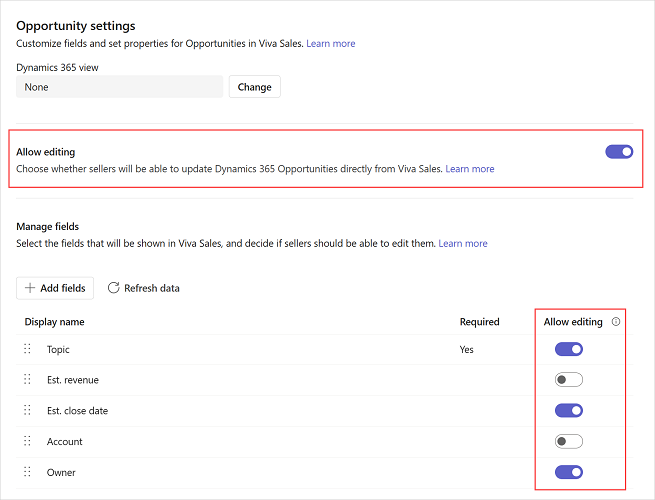
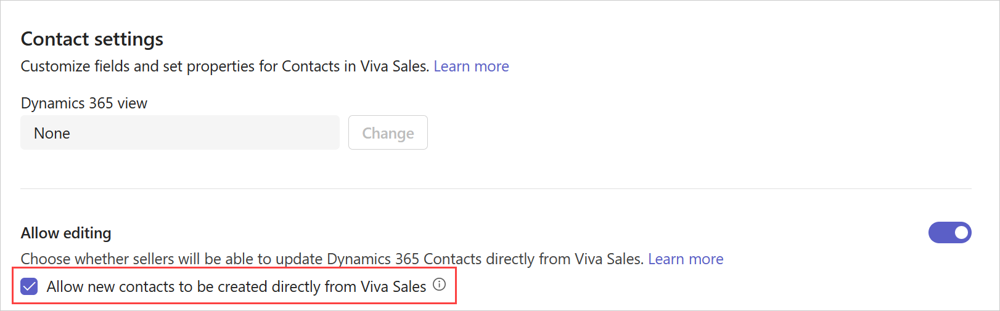
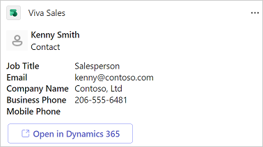
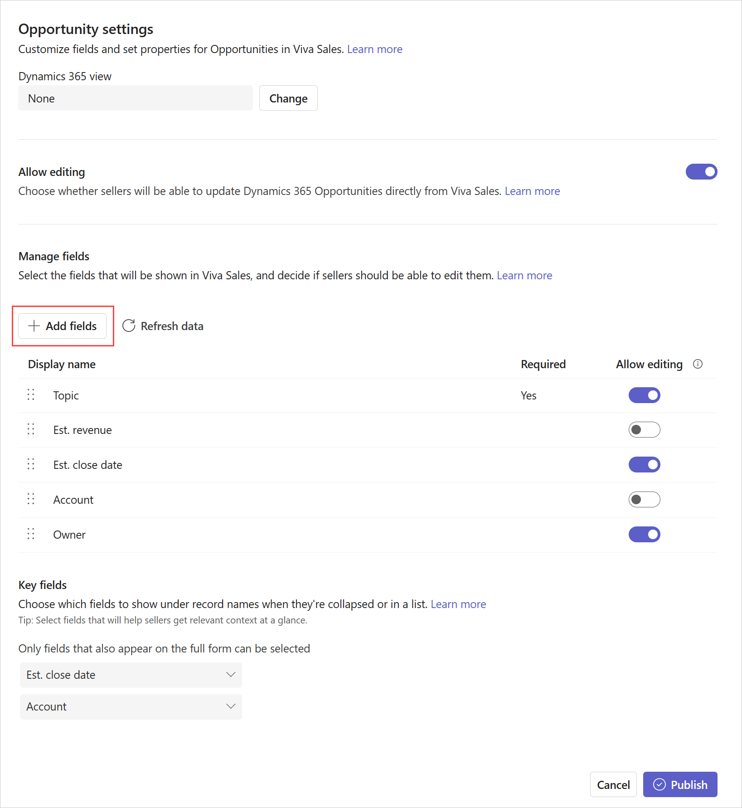

# Customize forms and fields

As an administrator, you can customize the CRM information that's displayed in Viva Sales to give your sellers a more relevant view.

CRM forms and fields customization is environment-specific—each environment has its own set of configurations. Contact, opportunity, and account record types are available by default. You can add other out-of-the-box and custom record types; and also remove them when not required.

Viva Sales forms and lists are based on CRM views. A view defines the list of columns to be displayed, how the list of records is sorted by default, and what default filters are applied to restrict which records will appear in the list. For contact, account, and opportunity record types, it is not mandatory to select a view. If you don't select a view, the default view is used. For other record types, you must select a view. 

Changes made to record types are reflected in the Viva Sales pane in Outlook and Adaptive Cards shared in Teams chat. When saving Outlook activities (emails and meetings) from Viva Sales to your CRM system, you can search for records of the added record types, and connect the activity to the record. When using Viva Sales app for Teams through messaging extensions, you can search for records of the added record types.

Record names, field names, and mandatory fields are displayed as they're defined in the CRM.

> [!NOTE]
> If you change the name of a record type in CRM, they are not updated in Adaptive Card or messaging extensions in Teams. For example, if you rename Account to Customer, the name in Adaptive Card and messaging extensions will show as Account.

:::image type="content" source="media/admin-settings.png" alt-text="Screenshot showing Viva Sales admin settings.":::

|Annotation  |Description  |
|---------|---------|
|1     |Select to customize forms and fields.  |
|2     |Add a new custom or out-of-the-box record type. More information: [Add a new record type](#add-a-new-record-type)  |
|3     |Refresh data from CRM. More information: [Refresh data from CRM](#refresh-data-from-crm) |
|4     |Record types added to Viva Sales.  |
|5     |View used to filter fields in a record. More information: [Change view of a record type](#change-view-of-a-record-type) |

You can select a record type to view and edit its settings.

## Prerequisites

CRM administrators must access administrator settings from the Viva Sales app in Teams. More information: [Administrator settings for Viva Sales](administrator-settings-for-viva-sales.md)

## Add a new record type

You can add new custom or out-of-the-box record types to Viva Sales. For example, you can add a custom record type called "Project" to track projects.

> [!NOTE]
> You can add up to 10 record types.

1. In Viva Sales admin settings, select **Forms**.

2. Select **Add a record type**.

3. In the **Add a record type** window, select a record type to add, and then select **Next**.

    > [!NOTE]
    > - Only record types that are related to a currently available record type are displayed. For example, contact, account, and opportunity record types are available by default, so you can add other out-of-the-box and custom record types that are related to these record types.
    > - You can add only one record type at a time.
    > - Logical names of record types and fields are displayed to optimize performance. 

    :::image type="content" source="media/select-record-type.png" alt-text="Select a record type tp add.":::

4. In the **Select the relationship for (record type)** window, select the relationship to existing record types or fields in Viva Sales, and then select **Next**.

    > [!NOTE]
    > - 1:N and N:1 relationships are supported.
    > - Logical names of record types and fields are displayed to optimize performance.
    > - This step is displayed if the record type you selected in the previous step relates to more than one record type or field. Otherwise, the relationship is automatically set.

    :::image type="content" source="media/select-relationship.png" alt-text="Select relationship for the record type.":::

5. In the **Select the view for (record type)** window, select the view to define how a list of records for a specific record type is displayed, and then select **Add**.

    > [!NOTE]
    > - All public and personal views are displayed in the list.
    > - A view includes only those fields that belong to the record type and not to any related record types.

    :::image type="content" source="media/select-view.png" alt-text="Select view for the record type.":::

6. On the record type settings page, select **Publish** to save your changes.

    The record type is added at the end of the list of record types.

## Configure editing of records and fields

You can control which records and fields sellers can edit directly in Viva Sales.

By default, contacts are editable. For other records, you must turn on the option to allow editing.

> [!VIDEO https://www.microsoft.com/en-us/videoplayer/embed/RE5fHzM]

**To allow editing of records**

1.  In Viva Sales admin settings, select **Forms**.

2.  Select a record type for which you need to allow editing.

3.  Turn on **Allow editing** to allow sellers to edit all relevant fields in that record type.

4.  To restrict editing for specific fields, in the **Manage fields** section, and turn off **Allow editing** for corresponding fields.

    

5.  Select **Publish** to save your changes.

## Configure new contact creation

You can control whether sellers can create contacts inline, directly in Viva Sales, or must do so in the CRM. By default, new contacts are created inline in Viva Sales.

**To configure new contact creation**:

1.  In Viva Sales admin settings, select **Forms**.

2.  Select the **Contact** record type.

3.  Under **Allow editing**, select **Allow new contacts to be created directly from Viva Sales**.

    

4.  Select **Publish** to save your changes.

## Manage fields shown in the detailed view

> [!NOTE]
> This section is relevant only for contact, opportunity, and account record types that are not based on a CRM view. If a view is selected for a record type, you'll not be able to [add fields](#add-fields), [remove fields](#remove-fields), and [reorder fields](#reorder-fields).

To customize the detailed view of CRM records in Viva Sales, select fields to include in the view and the order in which they should appear. Changes to the detailed view are reflected in the Viva Sales pane in Outlook and Adaptive Cards shared in Teams chat.

If a record type is not based on a CRM view, you can add up to 40 out-of-the-box and custom fields to a record form.

### Add fields

> [!VIDEO https://www.microsoft.com/en-us/videoplayer/embed/RE5fC5a]

**To add fields**

1.  In Viva Sales admin settings, select **Forms**.

2.  Select a record type to which you need to add fields.

3.  In the **Manage fields** section, select **Add fields**.

    

4.  In the **Add fields** window, select fields to display in the form, and then select **Add**.

    The new fields are added after existing fields, but you can [reorder them](#reorder-fields).

    > [!NOTE]
    > If you've connected Viva Sales to Salesforce, add only the fields that all users of Viva Sales have access to. If a user doesn't have access to some of the added fields, they'll not be able to view the CRM record.

5.  Select **Publish** to save your changes.

### Remove fields

1.  In Viva Sales admin settings, select **Forms**.

2.  Select the record type from which you need to remove fields.

3.  In the **Manage fields** section, hover over the field you want to remove from the form, and then select **Remove field** ().

4.  Select **Publish** to save your changes.

### Reorder fields

1.  In Viva Sales admin settings, select **Forms**.

2.  Select the record type in which you need to reorder fields.

3.  In the **Manage fields** section, hover over the field you want to reorder, and then select the **Move up** or **Move down** arrows ( ).

    You can also drag the field to change its order.

4.  Select **Publish** to save your changes.

## Select key fields for the mini view

Each record type has a mini view that displays limited information when they're collapsed or shown in a list. The mini view is available at various places in the Viva Sales pane, such as in the quick view on the CRM tab.

The mini view includes a fixed title and two configurable subtitle fields. The fields available in the mini view are the ones that are available in the detailed view. Key fields setting affect the Search behavior in Viva Sales add-in for Outlook. More information: [Search behavior in Viva Sales add-in for Outlook](#search-behavior-in-viva-sales-add-in-for-outlook)

**To select key fields**

1.  In Viva Sales admin settings, select **Forms**.

2.  Select the record type in which you need to select fields for mini view.

3.  In the **Key fields** section, select fields from the list.

    

4.  Select **Publish** to save your changes.

### Search behavior in Viva Sales add-in for Outlook

Key field settings affect the results when sellers search for connected records in Dynamics 365. In Dynamics 365, the search behavior for connected records depends on the quick find view. Make sure that the key fields you select for the mini view exist in the [quick find view](/dynamics365/customerengagement/on-premises/customize/choose-and-configure-columns?view=op-9-1), otherwise, the search list won’t show them. In Salesforce, the search is performed on the name and the additional fields selected for the mini view.

Key fields selected for record types affect the search results displayed for these records. Key fields are displayed, if they are not empty, along with the name of the record in the search results.

## Change view of a record type

You can change the view that a record type is based on by choosing a different view. For example, you can select a view to show only active accounts instead of all accounts.

When changing the view, the following existing settings for the record type are cleared and set to default.

- Existing key fields are removed, and new defaults are set.
- Edit behavior for record type remains unchanged.
- Edit behavior for fields is reset. If the record type is set to editable, and a new view is selected, the fields will become editable.

**To select a new view**

1. In Viva Sales admin settings, select **Forms**.

2. Select a record type for which you want to change the view.

3. Select **Change** beside the view field.

    :::image type="content" source="media/change-view.png" alt-text="Change view of a record type.":::    

4. Update the relationship, if required, and then select **Next**.

5. Select the view to use, and then select **Done**.

6. On the record type settings page, select **Publish** to save your changes.

## View filters used in a view

You can view the source query that's used to filter records in a view. For example, you can view the source query for the view that shows only active accounts.

It helps you to have clear understanding on how a record type is configured. For example, filtering and sorting criteria of fields, and order of fields. The query is displayed in a view-only mode and you can't make any changes to the query.

1. In Viva Sales admin settings, select **Forms**.

2. Select a record type for which you want to see the query used in the selected view.

3. Select **View filters** under the **Manage fields** section.

    :::image type="content" source="media/view-filters.png" alt-text="View filters used in a view.":::
    
    The **Filter conditions** window is displayed.

4. To copy the query XML, select **Copy XML**.

## Refresh data from CRM

You should refresh data to get recent changes from CRM into Viva Sales. For example, if you add a new field to a record type view in CRM, you should refresh data to reflect the new field in Viva Sales. You can refresh data either for all record type at once or for a specific record type.

### Refresh data for all record types

1. In Viva Sales admin settings, select **Forms**.

2. Select **Refresh data**.

### Refresh data for a specific record type

1. In Viva Sales admin settings, select **Forms**.

2. Hover over a record type for which you want to refresh data, and then select **More options** (**...**).

3. Select **Refresh** from the context menu.

Alternatively, you can select the record type, and then select **Refresh data** under **Manage fields**.

## Remove a record type

You can remove a record type from Viva Sales. When you remove a record type that has related record types in Viva Sales, all related record types are also removed. The changes are automatically published. You can't remove the contact record type.

1. In Viva Sales admin settings, select **Forms**.

2. Hover over the record type you want to remove, and then select **Remove (record type)** (:::image type="icon" source="media/delete-icon.png" border="false":::).

## Control order of record types in side pane

You can control the order in which record types are displayed in the **Viva Sales** side pane in Outlook. The order is based on the order in which record types are added to Viva Sales. You can change the order by removing and adding record types in the desired order. Default order for new environments is contact, opportunity, and account. Newly added record types are added at the end of the list.

## FAQ

### Are changes in the CRM reflected automatically in Viva Sales?

Changes made in the CRM aren't reflected automatically in Viva Sales. You must select **Refresh data** on the **Customize forms and fields** page to get the latest updates from the CRM. More information: [Refresh data](#refresh-data-from-crm)

### Why is the delete option disabled for some fields in the contact record?

If you enable new contact creation from within Viva Sales, you can't remove a field from the contact form if it's marked as required in CRM.

### Which fields can't be customized?

The following fields can't be added from the Viva Sales **Admin settings** page:

**Dynamics 365**

-   Fields of type File, Image, Rich text, or MultiSelect Option Set.

-   Entity Id

-   All fields where [**IsValidODataAttribute**](/dotnet/api/microsoft.xrm.sdk.metadata.attributemetadata.isvalidodataattribute?view=dataverse-sdk-latest&preserve-view=true) is set to false. 

**Salesforce**

-   Fields of type Geolocation, Text area (rich), Text area (encrypted), External Lookup Relationship, or Picklist (Multi-Select).

-   Entity Id

### How many fields can I add to a record?

You can add a maximum of 40 fields to a record.

### Why are some fields non-editable, although the record is set as editable?

A field can be noneditable in the following cases:
- The field is calculated
- The field is required in the CRM

### Why are users getting an error with error code 4100 when viewing a CRM record?

If you've connected Viva Sales to Salesforce, and your users see a 4100 error when viewing a CRM record, they don't have access to some of the fields added to be displayed. Ensure that all users of the app have access to the fields added to a CRM record.

