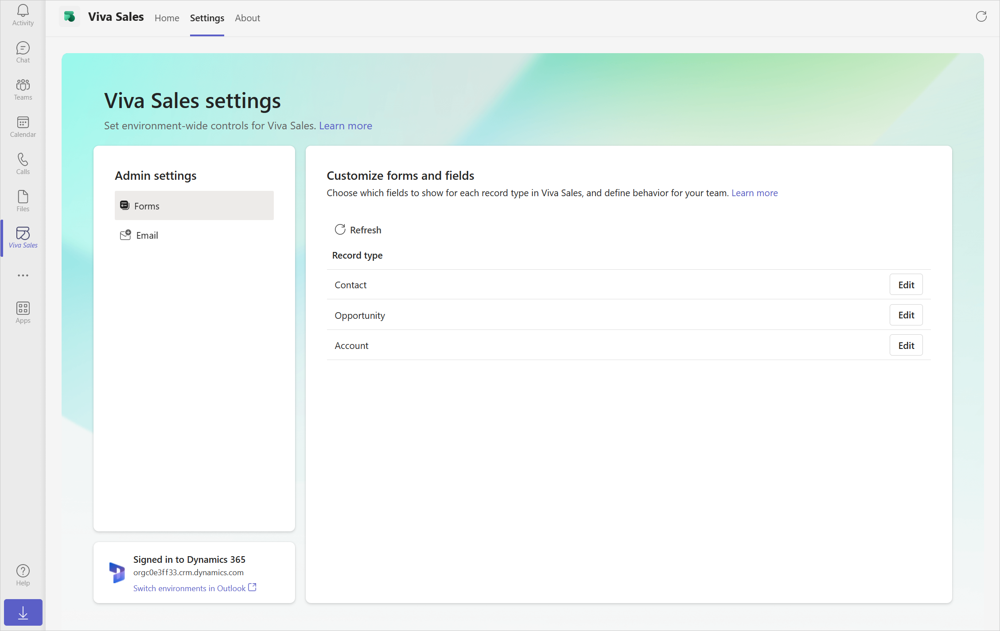
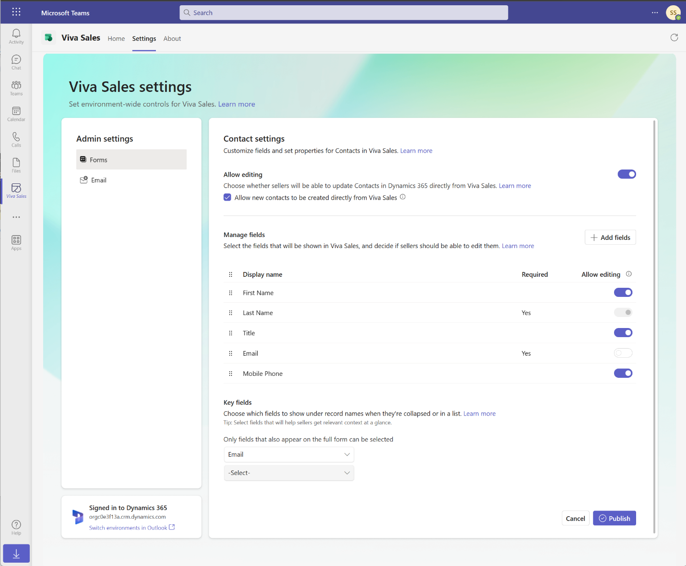
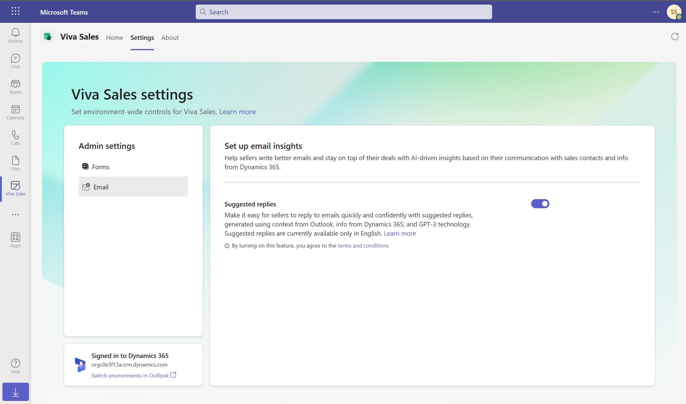

# Viva Sales deployment guide for Dynamics 365 customers

This guide provides you with step-by-step instructions on how to deploy Viva Sales for existing Dynamics 365 Sales customers.

## Step 1: Installing and auto deploying the Viva Sales Outlook Add-in

Viva Sales requires a tenant administrator to install the integrated app from the [Microsoft 365 admin center](https://admin.microsoft.com/). See [FAQ](#how-do-i-find-my-tenant-admin) for tips on finding your tenant administrator.

Follow the steps in the [Install Viva Sales as an integrated app.](install-viva-sales-as-an-integrated-app.md) topic to install and automatically deploy the Viva Sales Outlook add-in.

## Step 2: Create a setup policy to auto install and pin the Viva Sales app in Teams

Viva Sales requires an administrator to create the policy from the [Teams admin center](https://admin.teams.microsoft.com/dashboard).

Follow the steps in the [Install and pin Viva Sales in Teams](install-pin-viva-sales-teams.md) topic to install and pin the Viva Sales Teams app in your users' personal Teams environment and in meetings they create.

## Step 3: Enable Teams meeting transcripts

When Viva Sales is added to a Teams meeting, it generates a meeting summary automatically if the meeting is recorded with transcription on.

To enable transcripts for Teams calls for Sales conversational intelligence:

1.  Sign in to the [Teams admin center](https://admin.teams.microsoft.com).

2.  In the left pane, select **Meetings** &gt; **Meeting policies**.

3.  On the **Manage policies** tab, select **Add**.

4.  Select **Global (Org-wide default)** from the middle pane.

5.  On the new **Global (Org-wide default)** page, scroll down to the **Recording & transcription** section and enable the checkbox next to "Transcription".

6.  Select **Save**.

    

## Step 4: Verify users have the right security roles

If you are using the out-of-the-box Dynamics 365 Sales security roles listed below, no action is needed. Viva Sales privileges are added automatically for:

-   Primary sales roles: Salesperson or Sales Manager

-   Administration roles: System Administrator or System Customizer

If you are using custom security roles, see [Additional privileges required for Dynamics 365 customers](install-viva-sales.md#additional-privileges-required-for-dynamics-365-customers) to assign users the right roles and privileges.

## Step 5 (optional): Customize Viva Sales

Viva Sales provides CRM administrator settings to control the seller's experience in Outlook and Teams. See the [Administrator settings for Viva Sales](administrator-settings-for-viva-sales.md) topic to learn more.

Viva Sales comes pre-configured to get users up running to be productive out of the box. We understand the default CRM fields shown may not work for everyone. To customize the fields, follow the instructions in the [Customize forms and fields](customize-forms-and-fields.md) topic.

You can allow Viva Sales to generate suggested email replies using context from Outlook, your CRM, and leveraging GPT technology. See the [Allow suggested email replies to be generated in Outlook](suggested-replies.md) topic to learn how to enable.

You have now installed and configured Viva Sales in Outlook and Teams.

## Step 6: Welcome sellers in your organization to Viva Sales

Here is an example email message to share with your sellers, welcoming them to Viva Sales.

|  |
|---------|
|**Subject**: Welcome to Viva Sales! Dear Sellers, Welcome to Viva Sales, a new app that brings CRM data and AI-powered intelligence into your flow of work in Outlook and Teams. See what Viva Sales can do for you by [watching this short video](https://www.youtube.com/watch?v=hfDPogeGTHk) and getting started today. **Step 1: Logging into Viva Sales for the first time** The [Use Viva Sales in Outlook](https://support.microsoft.com/en-us/topic/use-viva-sales-in-outlook-ec3605f9-fdb0-4593-9c5b-b43a76c07081) topic shows you how to find Viva Sales within Outlook, sign into your CRM system and pin the app pane. **Additional resources** The following articles will guide you through using various Viva Sales features: <ul> <li>[Connect a contact to your CRM](https://support.microsoft.com/en-us/topic/connect-a-contact-to-your-crm-5e947640-24ef-48bc-a64d-be0ee32a9990)</li> <li>[Change the connected CRM contact](https://support.microsoft.com/en-us/topic/change-the-connected-crm-contact-b357d535-dc4c-478e-a9c4-7787d1875a82)</li> <li>[Create a contact in your CRM from Viva Sales](https://support.microsoft.com/en-us/topic/create-a-contact-in-your-crm-from-viva-sales-e0df1aa5-7824-4886-b954-15dc6219ce29)</li> <li>[Save Outlook activities to your CRM](https://support.microsoft.com/en-us/topic/save-outlook-activities-to-your-crm-ee4db5e3-91a5-4d29-b9c2-980959d2fdd7)</li> <li>[View recent and upcoming activities](https://support.microsoft.com/en-us/topic/view-recent-and-upcoming-activities-0f5b4dce-fb99-4c0c-9fbe-37b4be5f343a)</li> <li>[View CRM information](https://support.microsoft.com/en-us/topic/view-crm-information-512861d3-6e23-4eef-a8e5-3e3ed39cd776)</li> <li>[Add personal notes](https://support.microsoft.com/en-us/topic/add-personal-notes-ae382c0c-f0f5-48b7-b3b4-dec456e72fdd)</li> <li>[Share a link to a CRM record](https://support.microsoft.com/en-us/topic/share-a-link-to-a-crm-record-1704ce24-dfd7-45c0-a6a5-8f4e3f33f56d)</li> <li>[Edit a CRM record](https://support.microsoft.com/en-us/topic/edit-a-crm-record-f791a263-3eea-4d01-9211-6b32243617b4)</li> <li>[Use AI to kickstart email replies](https://support.microsoft.com/en-us/topic/use-ai-to-kickstart-email-replies-148708be-e1f9-477c-baba-0b4dd4b7abef)</li> <li>[Use Viva Sales in Teams](https://support.microsoft.com/en-us/topic/use-viva-sales-in-teams-04286b82-bdf8-4e37-94ce-be1943b2d6ea)</li> <li>[Create a Teams meeting](https://support.microsoft.com/en-us/topic/create-a-teams-meeting-f11d7a0b-654c-4bb7-9939-b053783f306b)</li> <li>[Generate a meeting summary](https://support.microsoft.com/en-us/topic/generate-a-meeting-summary-9dfef995-fb04-46d2-a9cf-bdc29855040b)</li> <li>[View and understand the meeting summary](https://support.microsoft.com/en-us/topic/view-and-understand-the-meeting-summary-020d5bc4-fc84-49ce-a343-fa75ad536b36)</li> <li>[Share a CRM record in a Teams conversation](https://support.microsoft.com/en-us/topic/share-a-crm-record-in-a-teams-conversation-e07cc6b4-9cc7-43ef-905e-b8ff0c8526ed)</li> <li>[View and update CRM record details](https://support.microsoft.com/en-us/topic/view-and-update-crm-record-details-881b506b-9604-4270-9fd7-1a7a8a253997)</li> </ul> **Troubleshooting** See the [Viva Sales troubleshooting guide](https://support.microsoft.com/en-us/topic/update-add-in-error-in-viva-sales-for-microsoft-outlook-bbc41354-113a-4eda-86aa-9c338954a559) topic for common problems and solutions. For additional community help visit the [Viva Sales - Microsoft Community Hub](https://techcommunity.microsoft.com/t5/viva-sales/bd-p/VivaSales) page. For ideas and suggestions visit the [Microsoft Viva Sales · Community](https://feedbackportal.microsoft.com/feedback/forum/7fcacc26-460c-ed11-b83d-000d3a4d91d1) page.     |

## Community

We encourage all Viva Sales users to visit and register on the [Viva Sales community](https://techcommunity.microsoft.com/t5/viva-sales/bd-p/VivaSales). The community has:

-   Forums to connect with peers and discuss shared experiences.

-   Forums to contribute and receive support on common issues which are routinely reviewed by our team of experts.

-   Spaces to [share ideas](https://feedbackportal.microsoft.com/feedback/forum/7fcacc26-460c-ed11-b83d-000d3a4d91d1) and engage with the product development team.

## FAQ

### Is Viva Sales included for Dynamics 365 Sales customers?

Viva Sales is a generally available app included as part of the Dynamics 365 Sales Enterprise and Premium products, [watch this short video to learn more.](https://www.youtube.com/watch?v=hfDPogeGTHk)

A Microsoft 365 for enterprise or Office 365 for enterprise product license is required to use the Viva Sales app in Outlook and Microsoft Teams.

### How does Viva Sales work?

Viva Sales is a productivity app that leverages an Outlook add-in and a Teams app to enable sales teams to manage their workflows efficiently by bringing the context of their CRM into their flow of work. To learn more about Viva Sales, see [Microsoft Viva Sales](https://www.microsoft.com/microsoft-viva/sales).

### Is Viva Sales safe and secure?

Yes, Viva Sales is a certified Microsoft app, meaning that it has passed Microsoft's rigorous security and compliance standards. Microsoft has a long-standing reputation for providing safe and secure software solutions.

For information on license requirements, role requirements, and region availability, see [Introduction to Microsoft Viva Sales](introduction.md) and [Viva Sales FAQ](https://support.microsoft.com/topic/viva-sales-faq-dd0b9203-a5d4-44ee-a173-cadc808c828a).

### How do I find my tenant admin?

See the [How do I find my Microsoft 365 admin?](https://support.microsoft.com/en-us/office/how-do-i-find-my-microsoft-365-admin-59b8e361-dbb6-407f-8ac3-a30889e7b99b) topic for helpful tips on finding your tenant admin.

It may be possible to find your tenant admin email address by looking at the [Azure Active Directory admin center Tenant properties page](https://aad.portal.azure.com/#view/Microsoft_AAD_IAM/ActiveDirectoryMenuBlade/~/Properties), if this page has not been locked down by an administrator, see the below screen shot example:

### Are there any special browser settings needed to use Viva Sales Outlook and Teams web versions?

When users are using web-based versions of Outlook or Teams, they may need to make some setting changes for full support.

**Edge**

-   Ensure "Enable sites to save and read cookie data (recommended)" is enabled.

-   Ensure make sure "Block third-party cookies" is disabled.

**Safari**

-   Ensure "Prevent Cross-site tracking" is turned off.

**Chrome**

-   Ensure "Block third party cookies" is disabled.

See the [Viva Sales troubleshooting guide](https://support.microsoft.com/en-us/topic/update-add-in-error-in-viva-sales-for-microsoft-outlook-bbc41354-113a-4eda-86aa-9c338954a559) topic for common problems and solutions.

