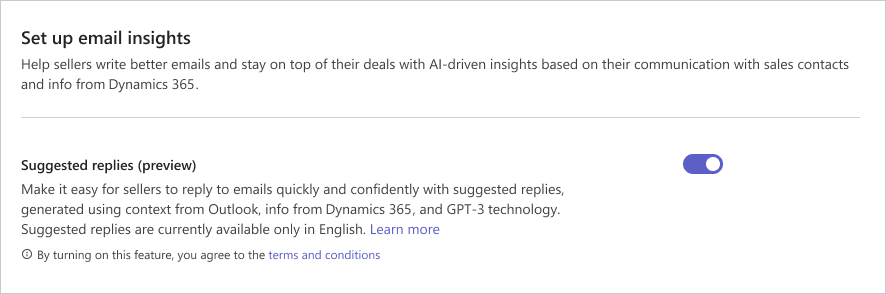

# Preview: Enable suggested email replies in Outlook

> [!IMPORTANT]
> This is a preview feature and the [preview terms](https://www.microsoft.com/licensing/terms/product/ForOnlineServices/EAEAS) for online services apply. A preview feature is a feature that is not complete but is made available before it’s officially released so customers can get early access and provide feedback. Preview features aren’t meant for production use and may have limited or restricted functionality. Microsoft doesn't provide support for this preview feature. Preview features aren’t meant for production use, especially to process personal data or other data that are subject to legal or regulatory compliance requirements.

As an administrator, you can allow Viva Sales to generate suggested replies using context from Outlook, your CRM, and GPT-3 technology. This makes it easy for your sellers to reply to emails quickly and confidently. By default, the capability to generate suggested replies is turned off.

> [!NOTE]
> - The AI-generated content is just a suggestion. It is your responsibility to review and edit the suggested content to make sure it’s accurate and appropriate before sending your email.
> - Suggested email replies is currently available only in English.
> -  Ensure that the Viva Sales for Outlook add-in is updated to the latest version (10.0.0.11 or newer) to use the copy to e-mail functionality of the suggested reply feature. For information on how to update the add-in, go to [Update the Viva Sales add-in](install-viva-sales-as-an-integrated-app.md#update-the-viva-sales-add-in).

**To enable suggested email replies in Outlook**

1.  In Viva Sales admin settings, select **Email**.

2.  Turn on **Suggested replies (preview)**.

    

## Data access and use

As part of providing AI suggestions (via Azure OpenAI), Microsoft will process and store Customer Data submitted to the service, as well as Output Content, for purposes of (1) monitoring for and preventing abusive or harmful uses or outputs of the service; and (2) developing, testing, and improving capabilities designed to prevent abusive use of and/or harmful outputs from the service. Authorized Microsoft employees may review data that has triggered our automated systems to investigate and verify potential abuse. Microsoft engineers and data scientists may also access and use this data to improve our systems that monitor for and prevent abusive or harmful uses or outputs of the service. For more information, see the [Azure OpenAI product documentation](/legal/cognitive-services/openai/data-privacy).

The Azure OpenAI Service is currently available in limited geographies. By using it through Viva Sales, you are affirming that you understand that Azure OpenAI services may be performed in a data center other than the data center that maintains your data. Learn more about [Data Residency in Azure](https://azure.microsoft.com/explore/global-infrastructure/data-residency/#overview) and read our [Privacy Statement](https://go.microsoft.com/fwlink/?LinkId=521839).

## FAQ

### Users don't see the **Copy to e-mail** button and instead only the **Copy text** button in the suggested e-mail feature.

Ensure that the Viva Sales for Outlook add-in is updated to the latest version (10.0.0.11 or newer) to use the copy to e-mail functionality of the suggested reply feature. For information on how to update the add-in, go to [Update the Viva Sales add-in](install-viva-sales-as-an-integrated-app.md#update-the-viva-sales-add-in).

### See also

[Use AI to kickstart email replies](https://support.microsoft.com/topic/use-ai-to-kickstart-email-replies-148708be-e1f9-477c-baba-0b4dd4b7abef)
